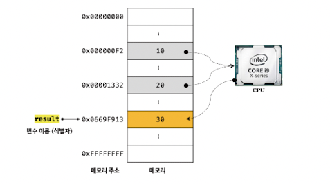
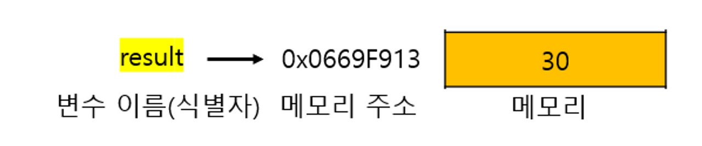
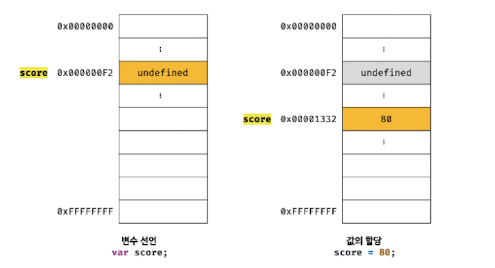
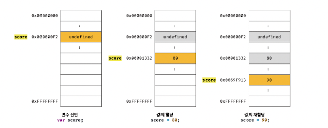

## 4.1 변수란 무엇인가? 왜 필요한가?

- 변수(variable)는 하나의 값을 저장하기 위해 확보한 메모리 공간 자체 또는 그 메모리 공간을 식별하기 위해 붙인 이름을 말한다.
- 변수는 프로그래밍 언어에서 값을 저장하고 참조하는 메커니즘으로, 값의 위치를 가리키는 상징적인 이름이다.
- 메모리 공간에 값을 식별할 수 있는 고유한 이름을 변수 이름이라 한다.
- 변수에 저장된 값을 변수 값이라고 한다.
- 변수에 값을 저장하는 것을 할당(assignment)(대입, 저장)이라 하고, 변수에 저장된 값을 읽어 들이는 것을 참조(reference)라 한다.

## 4.2 식별자

- 변수 이름을 식별자(identifier)라고도 한다.
- 식별자는 어떤 값을 구별해서 식별할 수 있는 고유한 이름을 말한다.
- 식별자는 값이 아니라 메모리 주소를 기억하고 있다.

## 4.3 변수 선언

- 변수를 사용하려면 반드시 선언이 필요하다. 
- 변수를 선언할 때는 var, let, const 키워드를 사용한다.

`키워드`

	키워드는 자바스크립트 코드를 해석하고 실행하는 자바스크립트 엔진이 수행할 동작을 규정한 일종의 명령어다.

- 자바스크립트 엔진은 변수 선언을 다음과 같은 2단계에 거쳐 수행한다.
	- 선언 단계: 변수 이름을 등록해서 자바스크립트 엔진에 변수의 존재를 알린다.
	- 초기화 단계: 값을 저장하기 위한 메모리 공간을 확보하고 암묵적으로 undefined를 할당해 초기화한다.

`변수 이름은 어디에 등록되는가?`
- 변수 이름을 비롯한 모든 식별자는 실행 컨텍스트에 등록된다.
- 실행 컨텍스트(execution context)는 자바스크립트 엔진이 소스코드를 평가하고 실행하기 위해 필요한 환경을 제공하고 코드의 실행 결과를 실제로 관리하는 영역이다. 
- 자바스크립트 엔진은 실행 컨텍스트를 통해 식별자와 스코프를 관리한다.
- 변수 이름과 변수 값은 실행 컨텍스트 내에 키(key)/값(value) 형식인 객체로 등록되어 관리된다.
## 4.4 변수 선언의 실행 시점과 변수 호이스팅

자바스크립트 엔진은 소스코드를 한 줄씩 순차적으로 실행하기에 앞서 먼저 소스코드의 평가 과정을 거치면서 소스코드를 실행하기 위한 준비를 한다. 이때 소스코드 실행을 위한 준비단계인 소스코드의 평가 과정에서 자바스크립트 엔진은 변수 선언을 포함한 모든 선언문(변수 선언문, 함수 선언문 등)을 소스코드에서 찾아내 먼저 실행한다. 그리고 소스코드의 평가 과정이 끝나면 비로소 변수 선언을 포함한 모든 선언문을 제외하고 소스코드를 한 줄씩 순차적으로 실행한다.

자바스크립트 엔진은 변수 선언이 소스코드의 어디에 있든 상관없이 다른 코드보다 먼저 실행한다. 따라서 변수 선언이 소스코드 어디에 위치하는지와 상관없이 어디서든지 변수를 참조할 수 있다.

변수 선언문이 코드의 선두로 끌어 올려진 것처럼 동작하는 자바스크립트 고유의 특징을 변수 호이스팅(variable hoisting)이라 한다.

변수 선언뿐만 아니라 var, let, const, function, function*, class 키워드를 사용해서 선언하는 모든 식별자(변수, 함수, 클래스 등)는 호이스팅된다. 

모든 선언문은 런타임 이전 단계에서 먼저 실행되기 때문이다.

```javascript
console.log(score); // undefined

var score; // 변수 선언문
```
## 4.5 값의 할당
변수에 값을 할당(assignment)(대입, 저장)할 때는 할당 연산자 =를 사용한다. 할당 연산자는 우변의 값을 좌변의 변수에 할당한다.
```javascript
var score; // 변수 선언
score = 80; // 값의 할당
```
변수 선언과 값의 할당을 다음과 같이 하나의 문(statement)으로 단축 표현할 수도 있다.
```javascript
var score = 80; // 변수 선언과 값의 할당
```
변수 선언과 값의 할당을 2개의 문으로 나누어 표현한 코드와 변수 선언과 값의 할당을 하나의 문으로 단축 표현한 코드는 정확히 동일하게 동작한다. 즉, 자바스크립트 엔진은 변수 선언과 값의 할당을 하나의 문으로 단축 표현해도 변수 선언과 값의 할당을 2개의 문으로 나누어 각각 실행한다.

이때 주의할 점은 변수 선언과 값의 할당의 실행 시점이 다르다는 것이다. 변수 선언은 소스코드가 순차적으로 실행되는 시점인 런타임 이전에 먼저 실행되지만 값의 할당은 소스코드가 순차적으로 실행되는 시점인 런타임에 실행된다.


## 4.6 값의 재할당
---
재할당이란 이미 값이 할당되어 있는 변수에 새로운 값을 또다시 할당하는 것을 말한다.
```javascript
var score = 80; // 변수 선언과 값의 할당
score = 90; // 값의 재할당
```



`가비지 콜렉터(garbage collector)`

	가비지 콜렉터는 애플리케이션이 할당(allocate)한 메모리 공간을 주기적으로 검사하여 더 이상 사용되지 않는 메모리를 해제(release)하는 기능을 말한다. 더 이상 사용되지 않는 메모리란 간단히 말하자면 어떤 식별자도 참조하지 않는 메모리 공간을 의미한다. 자바스크립트는 가비지 콜렉터를 내장하고 있는 매니지드 언어로서 가비지 콜렉터를 통해 메모리 누수(memory leak)를 방지한다.

`언매니지드 언어(unmanaged language)와 매니지드 언어(managed language)`

	프로그래밍 언어는 메모리 관리 방식에 따라 언매니지드 언어와 매니지드 언어로 분류할 수 있다.
	C 언어와 같은 언매니지드 언어는 개발자가 명시적으로 메모리를 할당하고 해제하기 위해 malloc()과 free() 같은 저수준(low-level) 메모리 제어 기능을 제공한다. 언매니지드 언어는 메모리 제어를 개발자가 주도할 수 있으므로 개발자의 역량에 따라 최적의 성능을 확보할 수 있지만 그 반대의 경우 치명적 오류를 생산할 가능성도 있다.
	자바스크립트 같은 매니지드 언어는 메모리의 할당 및 해제를 위한 메모리 관리 기능을 언어 차원에서 담당하고 개발자의 직접적인 메모리 제어를 허용하지 않는다. 즉, 개발자가 명시적으로 메모리를 할당하고 해제할 수 없다. 더 이상 사용하지 않는 메모리의 해제는 가비지 콜렉터가 수행하여, 이 또한 개발자가 관여할 수 없다. 매니지드 언어는 개발자의 역량에 의존하는 부분이 상대적으로 작아져 어느 정도 일정한 생산성을 확보할 수 있다는 장점이 있지만 성능 면에서 어느 정도 손실은 감수할 수밖에 없다.

## 4.7 식별자 네이밍 규칙

식별자는 어떤 값을 구별해서 식별해낼 수 있는 고유한 이름을 말한다. 식별자는 다음과 같은 네이밍 규칙을 준수해야 한다.
- 식별자는 특수문자를 제외한 문자, 숫자, 언더스코어(_), 달러 기호($)를 포함할 수 있다.
- 단, 식별자는 특수문자를 제외한 문자, 언더스코어(_), 달러 기호($)로 시작해야 한다. 숫자로 시작하는 것은 허용하지 않는다.
- 예약어는 식별자로 사용할 수 없다.

네이밍 컨벤션(naming convention)은 하나 이상의 영어 단어로 구성된 식별자를 만들 때 가독성 좋게 단어를 한눈에 구분하기 위해 규정한 명명 규칙이다. 네이밍 컨벤션을 잘 지키면 읽기 좋은 이름을 만들 수 있다. 다음과 같은 4가지 유형의 네이밍 컨벤션이 자주 사용된다.

```javascript
// 카멜 케이스(camelCase)
var firstName;

// 스네이크 케이스(snake_case)
var first_name;

// 파스칼 케이스(PascalCase)
var FirstName;

// 헝가리언 케이스(typeHungarianCase)
var strFirstName; // type + identifier
var $elem = document.getElementById('myId'); // DOM 노드
var observable$ = fromEvent(document, 'click'); // RxJS 옵저버블
```

자바스크립트에서는 일반적으로 변수나 함수의 이름에는 카멜 케이스를 사용하고, 생성자 함수, 클래스의 이름에는 파스칼 케이스를 사용한다. 

