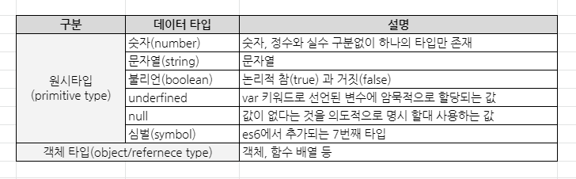
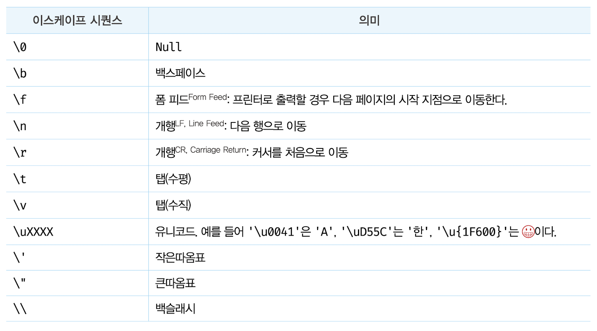

# 6 데이터 타입

- 데이터 타입(data type)(줄여서 '타입'이라고도 한다)은 값의 종류를 말한다.
- 자바스크립트의 모든 값은 데이터 타입을 갖는다.
- 자바스크립트(ES6)는 7개의 데이터 타입을 제공한다.
- 7개의 데이터 타입은 원시 타입(primitive type)과 객체 타입(object/reference type)으로 분류할 수 있다.

- ECMAScript2020(ES11)에서 새로운 원시값 BigInt가 추가되었다. 따라서 ES11을 기준으로 자바스크립트에서 제공하는 데이터 타입은 총 8개가 되었다. 

## 6.1 숫자 타입

- C나 자바의 경우, 정수(소수점 이하가 없는 숫자)와 실수(소수점 이하가 있는 숫자)를 구분해서 int, long, float, double 등과 같은 다양한 숫자 타입을 제공한다. 하지만 자바스크립트는 독특하게 하나의 숫자 타입만 존재한다.
- ECMAScript 사양에 따르면 숫자 타입의 값은 배정밀도 64비트 부동소수점 형식을 따른다. 즉, 모든 수를 실수로 처리하며, 정수만 표현하기 위한 데이터 타입(integer type)이 별도로 존재하지 않는다.

```javascript
// 모두 숫자 타입이다.
var integer = 10;   // 정수
var double = 10.12; // 실수
var negative = -20; // 음의 정수
```

- 정수, 실수, 2진수, 8진수, 16진수 리터럴은 모두 메모리에 배정밀도 64비트 부동소수점 형식의 2진수로 저장된다. 
- 자바스크립트는 2진수, 8진수, 16진수를 표현하기 위한 데이터 타입을 제공하지 않기 때문에 이들 값을 참조하면 모두 10진수로 해석된다.

```javascript
var binary = 0b01000001; // 2진수
var octal = 0o101;       // 8진수
var hex = 0x41;          // 16진수

// 표기법만 다를 뿐 모두 같은 값이다.
console.log(binary);  // 65
console.log(octal);   // 65
console.log(hex);     // 65
console.log(binary === octal); // true
console.log(octal === hex);    // true
```

- 정수로 표시되는 수끼리 나누더라도 실수가 나올 수 있다.

```javascript
// 숫자 타입은 모두 실수로 처리된다.
console.log(1 === 1.0); // true
console.log(4 / 2); // 2
console.log(3 / 2); // 1.5
```

- 숫자 타입은 추가적으로 세 가지 특별한 값도 표현할 수 있다.
	- Infinity: 양의 무한대
	- -Infinity: 음의 무한대
	- NaN: 산술 연산 불가(not-a-number)

```javascript
// 숫자 타입의 세 가지 특별한 값
console.log(10 / 0);        // Infinity
console.log(10 / -0);       // -Infinity
console.log(1 * 'String');  // NaN
```

- 자바스크립트는 대소문자를 구별(case-sensitive)하므로 NaN을 NAN, Nan, nan과 같이 표현하면 에러가 발생하므로 주의하기 바란다.
- 자바스크립트 엔진은 NAN, Nan, nan을 값이 아닌 식별자로 해석한다.

```javascript
// 자바스크립트는 대소문자를 구별한다.
var x = nan; // ReferenceError: nan is not defined
```

## 6.2 문자열 타입

- 문자열(string) 타입은 텍스트 데이터를 나타내는 데 사용한다.
- 문자열은 0개 이상의 16비트 유니코드 문자(UTF-16)의 집합으로 전 세계 대부분의 문자를 표현할 수 있다.
- 문자열은 작은따옴표(''), 큰따옴표(""), 백틱으로 텍스트를 감싼다. 

```javascript
// 문자열 타입
var String;
string = '문자열'; // 작은따옴표
string = "문자열"; // 큰따옴표
string = `문자열`; // 백틱(ES6)
string = '작은따옴표로 감싼 문자열 내의 "큰따옴표"는 문자열로 인식된다.';
string = "큰따옴표로 감싼 문자열 내의 '작은따옴표로'는 문자열로 인식된다.";
```

- 다른 타입의 값과 달리 문자열을 따옴표로 감싸는 이유는 키워드나 식별자 같은 토큰과 구분하기 위해서다. 만약 문자열을 따옴표로 감싸지 않으면 자바스크립트 엔진은 키워드나 식별자 같은 토큰으로 인식한다.

```javascript
// 따옴표로 감싸지 않은 hello를 식별자로 인식한다.
var string = hello; // ReferenceError: hello is not defined
```

- 따옴표로 문자열을 감싸지 않는다면 스페이스와 같은 공백 문자도 포함시킬 수 없다.
- C는 문자열 타입을 제공하지 않고 문자의 배열로 문자열을 표현하고, 자바는 문자열을 객체로 표현한다. 그러나 자바스크립트의 문자열은 원시 타입이며, 변경 불가능한 값(immutable value)이다. 이것은 문자열이 생성되면 그 문자열을 변경할 수 없다는 것을 의미한다.

## 6.3 템플릿 리터럴

- ES6부터 템플릿 리터럴(template literal)이라고 하는 새로운 문자열 표기법이 도입되었다.
- 템플릿 리터럴은 멀티라인 문자열(multi-line string), 표현식 삽입(expression interpolation), 태그드 템플릿(tagged template)등 편리한 문자열 처리 기능을 제공한다.
- 템플릿 리터럴은 런타임에 일반 문자열로 변환되어 처리된다.
- 템플릿 리터럴은 백틱을 사용해 표현한다.
```javascript
var template = `Template literal`;
console.log(template); // Template literal
```

### 6.3.1 멀티라인 문자열

- 일반 문자열 내에서는 줄바꿈(개행)이 허용되지 않는다.

```javascript
var str = 'Hello
world.';
// SyntaxError: Invalid or unexpected token
```

- 따라서 일반 문자열 내에서 줄바꿈 등의 공백(white space)을 표현하려면 백슬래시(\\)로 시작하는 이스케이프 시퀀스(escape sequence)를 사용해야 한다.



```javascript
var template = '<ul>\n\t<li><a href="#">Home</a></li>\n</ul>';
console.log(template);
```

- 템플릿 리터럴 내에서는 이스케이프 시퀀스를 사용하지 않고도 줄바꿈이 허용되며, 모든 공백도 있는 그대로 적용된다.

```javascript
var template = `<ul>
  <li><a href="#">Home</a></li>
</ul>`;

console.log(template);
```

### 6.3.2 표현식 삽입

- 문자열은 문자열 연산자 +를 사용해 연결할 수 있다. +연산자는 피연산자 중 하나 이상이 문자열인 경우 문자열 연결 연산자로 동작한다. 그 외의 경우는 덧셈 연산자로 동작한다.

```javascript
var first = 'Ung-mo';
var last = 'Lee';

// ES5: 문자열 연결
console.log('My name is ' + first + ' ' + last + '.'); // My name is Ung-mo Lee.
```

- 템플릿 리터럴 내에서는 표현식 삽입(expression interpolation)을 통해 간단히 문자열을 삽입할 수 있다. 이를 통해 문자열 연산자보다 가독성 좋고 간편하게 문자열을 조합할 수 있다.

```javascript
var first = 'Ung-mo';
var last = 'Lee';

// ES6: 표현식 삽입
console.log(`'My name is ${first} ${last}.`); // My name is Ung-mo Lee.
```

- 표현식을 삽입하려면 ${ }으로 표현식을 감싼다. 이때 표현식의 평가 결과가 문자열이 아니더라도 문자열로 타입이 강제로 변환되어 삽입된다.

```javascript
console.log(`1 + 2 = ${1 + 2}`); // 1 + 2 = 3
```

- 표현식 삽입은 반드시 템플릿 리터럴 내에서 사용해야 한다. 템플릿 리터럴이 아닌 일반 문자열에서의 표현식 삽입은 문자열로 취급된다.

```javascript
console.log('1 + 2 = ${1 + 2}'); // 1 + 2 = ${1 + 2}
```

## 6.4 불리언 타입

- 불리언 타입의 값은 논리적 참, 거짓을 나타내는 true와 false뿐이다.

```javascript
var foo = true;
console.log(foo); // true

foo = false;
console.log(foo); // false
```

## 6.5 undefined 타입

- undefined 타입의 값은 undefined가 유일하다.

```javascript
var foo;
console.log(foo); // undefined
```

## 6.6 null 타입

- null 타입의 값은 null이 유일하다.
- 자바스크립트는 대소문자를 구별하므로 null은 Null, NULL 등과 다르다.
- 프로그래밍 언어에서 null은 변수에 값이 없다는 것을 의도적으로 명시(의도적 부재: intentional absence)할 때 사용한다.
- 변수에 null을 할당하는 것은 변수가 이전에 참조하던 값을 더이상 참조하지 않겠다는 의미다. 
- 자바스크립트 엔진은 누구도 참조하지 않는 메모리 공간에 대해 가비지 콜렉션을 수행할 것이다.

```javascript
var foo = 'Lee';

// 이전 참조를 제거. foo 변수는 더 이상 'Lee'를 참조하지 않는다.
// 유용해 보이지는 않는다. 변수의 스코프를 좁게 만들어 변수 자체를 재빨리 소멸시키는 편이 낫다.
foo = null;
```

- 함수가 유효한 값을 반환할 수 없는 경우 명시적으로 null을 반환하기도 한다.

```html
<!DOCTYPE html>
<html lang="en">
<body>
  <script>
    var element = document.querySelector('.myClass');
    
    // HTML 문서에 myClass 클래스를 갖는 요소가 없다면 null을 반환한다.
    console.log(element); // null
  </script>
</body>
</html>
```

## 6.7 심벌 타입

- 심벌(Symbol)은 ES6에서 추가된 7번째 타입으로, 변경 불가능한 원시 타입의 값이다.
- 심벌 값은 다른 값과 중복되지 않는 유일무이한 값이다.
- 주로 이름이 충돌할 위험이 없는 객체의 유일한 프로퍼티 키를 만들기 위해 사용한다.
- 심벌 이외의 원시 값은 리터럴을 통해 생성하지만 심벌은 Symbol 함수를 호출해 생성한다. 이때 생성된 심벌 값은 외부에 노출되지 않으며, 다른 값과 절대 중복되지 않는 유일무이한 값이다.

```javascript
// 심벌 값 생성
var key = Symbol('key');
console.log(typeof key); // symbol

// 객체 생성
var obj = {};

// 이름이 충돌할 위험이 없는 유일무이한 값인 심벌을 프로퍼티 키로 사용한다.
obj[key] = 'value';
console.log(obj[key]); // value
```

## 6.8 객체 타입

자바스크립트는 객체 기반의 언어이며, 자바스크립트를 이루고 있는 거의 모든 것이 객체다.

## 6.9 데이터 타입의 필요성

- 값을 저장할 때 확보해야 하는 메모리 공간의 크기를 결정하기 위해
- 값을 참조할 때 한 번에 읽어 들여야 할 메모리 공간의 크기를 결정하기 위해
- 메모리에서 읽어 들인 2진수를 어떻게 해석할지 결정하기 위해

## 6.10 동적 타이핑

### 6.10.1 동적 타입 언어와 정적 타입 언어

- C나 자바 같은 정적 타입(static/strong type) 언어는 변수를 선언할 때 변수에 할당할 수 있는 값의 종류, 즉 데이터 타입을 사전에 선언해야 한다. 이를 명시적 타입 선언(explicit type declarartion)이라 한다.
- 정적 타입 언어는 변수의 타입을 변경할 수 없으며, 변수에 선언한 타입에 맞는 값만 할당할 수 있다. 
- 정적 타입 언어는 컴파일 시점에 타입 체크(선언한 데이터 타입에 맞는 값을 할당했는지 검사하는 처리)를 수행한다.
- 만약 타입 체크를 통과하지 못했다면 에러를 발생시키고 프로그램의 실행 자체를 막는다.
- 이를 통해 타입의 일관성을 강제함으로써 더욱 안정적인 코드의 구현을 통해 런타임에 발생하는 에러를 줄인다.
- 대표적인 정적 타입 언어로 C, C++, 자바, 코틀린, 고, 하스켈, 러스트, 스칼라 등이 있다.

- 자바스크립트의 변수는 선언이 아닌 할당에 의해 타입이 결정(타입 추론: type inference)된다. 그리고 재할당에 의해 변수의 타입은 언제든지 동적으로 변할 수 있다.
- 이러한 특징을 동적 타이핑(dynamic typing)이라 하며, 자바스크립트를 정적 타입 언어와 구별하기 위해 동적 타입(dynamic/week type) 언어라 한다.
- 대표적인 동적 타입 언어로는 자바스크립트, 파이썬, PHP, 루비, 리스프, 펄 등이 있다.

### 6.10.2 동적 타입 언어와 변수

- 동적 타입 언어는 변수에 어떤 데이터타입의 값이라도 자유롭게 할당할 수 있다.
- 변수 값은 언제든지 변경될 수 있기 때문에 복잡한 프로그램에서는 변화하는 변수 값을 추적하기 어려울 수 있다. 
- 변수 타입이 고정되어 있지 않고 동적으로 변하는 동적 타입 언어의 변수는 값의 변경에 의해 타입도 언제든지 변경될 수 있다.
- 동적 타입 언어의 변수는 값을 확인하기 전에는 타입을 확신할 수 없다.
- 자바스크립트는 개발자의 의도와는 상관없이 자바스크립트 엔진에 의해 암묵적으로 타입이 자동으로 변환되기도 한다.
- 동적 타입 언어는 유연성(flexibility)은 높지만 신뢰성(reliability)은 떨어진다.


