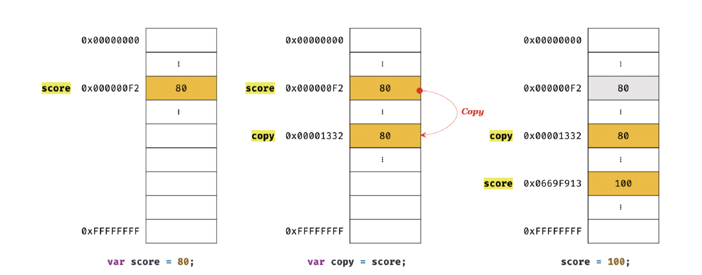

# 11 원시 값과 객체의 비교

- 원시 타입과 객체 타입은 크게 세 가지 측면에서 다르다.
	- 원시 타입의 값, 즉 원시 값은 변경 불가능한 값(immutable value)이다. 이에 비해 객체(참조) 타입의 값, 즉 객체는 변경 가능한 값(mutable value)이다.
	- 원시 값을 변수에 할당하면 변수(확보된 메모리 공간)에는 실제 값이 저장된다. 이에 비해 객체를 변수에 할당하면 변수(확보된 메모리 공간)에는 참조 값이 저장된다.
	- 원시 값을 갖는 변수를 다른 변수에 할당하면 원본의 원시 값이 복사되어 전달된다. 이를 값에 의한 전달(pass by value)이라 한다. 이에 비해 객체를 가리키는 변수를 다른 변수에 할당하면 원본의 참조 값이 복사되어 전달된다. 이를 참조에 의한 전달(pass by reference)이라 한다.

## 11.1 원시 값

### 11.1.1 변경 불가능한 값

- 원시 타입(primitive type)의 값, 즉 원시 값은 변경 불가능한 값(immutable value)이다. 한번 생성된 원시 값은 읽기 전용(read only)값으로서 변경할 수 없다.
- 변경 불가능하다는 것은 변수가 아니라 값에 대한 진술이다.
- "원시 값은 변경 불가능하다"는 말은 원시 값 자체를 변경할 수 없다는 것이지 변수 값을 변경할 수 없다는 것이 아니다.

```javascript
// const 키워드를 사용해 선언한 변수는 재할당이 금지된다. 상수는 재할당이 금지된 변수일 뿐이다.
const o = {};

// const 키워드를 사용해 선언한 변수에 할당한 원시 값(상수)은 변경할 수 없다.
// 하지만 const 키워드를 사용해 선언한 변수에 할당한 객체는 변경할 수 있다.
o.a = 1;
console.log(o); // { a: 1 }
```

- 원시 값은 변경 불가능한 값, 즉 읽기 전용 값이다. 원시 값은 어떤 일이 있어도 불변한다. 이러한 원시 값의 특성은 데이터의 신뢰성을 보장한다.

 

- 불변성을 갖는 원시 값을 할당한 변수는 재할당 이외에 변수 값을 변경할 수 있는 방법이 없다.

### 11.1.2 문자열과 불변성

- ECMAScript 사양에 문자열 타입(2바이트)과 숫자 타입(8바이트) 이외의 원시 타입은 크기를 명확히 규정하고 있지는 않아서 브라우저 제조사의 구현에 따라 원시 타입의 크기는 다를 수 있다.
- 문자열은 0개 이상의 문자(character)로 이뤄진 집합을 말하며, 1개의 문자는 2바이트의 메모리 공간에 저장된다.
- 문자열은 몇 개의 문자로 이뤄졌느냐에 따라 필요한 메모리 공간의 크기가 결정된다. 
- 숫자 값은 1도, 1000000도 동일한 8바이트가 필요하지만 문자열의 경우 (실제와는 다르지만 단순하게 계산했을 때) 1개의 문자로 이뤄진 문자열은 2바이트, 10개의 문자로 이뤄진 문자열은 20바이트가 필요하다.

```javascript
// 문자열은 0개 이상의 문자로 이뤄진 집합이다.
var str1 = '';      // 0개의 문자로 이뤄진 문자열(빈 문자열)
var str2 = 'Hello'; // 5개의 문자로 이뤄진 문자열
```

- 자바스크립트의 문자열은 원시 타입이며, 변경 불가능하다. 이것은 문자열이 생성된 이후에는 변경할 수 없음을 의미한다.
- 문자열은 유사 배열 객체이면서 이터러블이므로 배열과 유사하게 각 문자에 접근할 수 있다.

`유사 배열 객체(array-like object)`

유사 배열 객체란 마치 배열처럼 인덱스로 프로퍼티 값에 접근할 수 있고 length 프로퍼티를 갖는 객체를 말한다. 문자열은 마치 배열처럼 인덱스를 통해 각 문자에 접근할 수 있으며, length 프로퍼티를 갖기 때문에 유사 배열 객체이고 for 문으로 순회할 수도 있다.

```javascript
var str = 'string';

// 문자열은 유사 배열이므로 배열과 유사하ㅔ 인덱스를 사용해 각 문자에 접근할 수 있다.
console.log(str[0]); // s

// 원시 값인 문자열이 객체처럼 동작한다.
console.log(str.length); // 6
console.log(str.toUpperCase()); // STRING
```

```javascript
var str = 'string';

// 문자열은 유사 배열이므로 배열과 유사하게 인덱스를 사용해 각 문자에 접근할 수 있다.
// 하지만 문자열은 원시 값이므로 변경할 수 없다. 이때 에러가 발생하지 않는다.
str[0] = 'S';

console.log(str); // string
```

- 변수에 새로운 문자열을 재할당하는 것은 가능하다. 이는 기존 문자열을 변경하는 것이 아니라 새로운 문자열을 새롭게 할당하는 것이기 때문이다.

### 11.1.3 값에 의한 전달

```javascript
var score = 80;
var copy = score;

console.log(score); // 80
console.log(copy);  // 80

score = 100;

console.log(score); // 100
console.log(copy); // 80
```

- 변수에 원시 값을 갖는 변수를 할당하면 할당받는 변수에는 할당되는 변수의 원시 값이 복사되어 전달된다. 이를 값에 의한 전달이라한다.

```javascript
var score = 80;

// copy 변수에는 score 변수의 값 80이 복사되어 할당된다.
var copy = score;

console.log(score, copy); // 80 80
console.log(score === copy); // true
```

 

```javascript
var score = 80;

// copy 변수에는 score 변수의 값 80이 복사되어 할당된다.
var copy = score;

console.log(score, copy); // 80 80
console.log(score === copy); // true

// score 변수와 copy 변수의 값은 다른 메모리 공간에 저장된 별개의 값이다.
// 따라서 score 변수의 값을 변경해도 copy 변수의 값에는 어떠한 영향도 주지 않는다.
score = 100;

console.log(score, copy); // 100 80
console.log(score === copy); // false
```



- 두 변수의 원시 값은 서로 다른 메모리 공간에 저장된 별개의 값이 되어 어느 한쪽에서 재할당을 통해 값을 변경하더라도 서로 간섭할 수 없다.

## 11.2 객체

- 객체는 프로퍼티의 개수가 정해져 있지 않으며, 동적으로 추가되고 삭제할 수 있다. 또한 프로퍼티의 값에 제약이 없다.
- 객체는 원시 값과 같이 확보해야 할 메모리 공간의 크기를 사전에 정해 둘 수 없다.
- 객체는 복합적인 자료구조이므로 객체를 관리하는 방식이 원시 값과 비교해서 복잡하고 구현 방식도 브라우저 제조사마다 다를 수 있다. 

### 11.2.1 변경 가능한 값

- 객체(참조) 타입의 값, 즉 객체는 변경 가능한 값(mutable value)이다. 

```javascript
var person = {
  name: 'Lee'
};
```

- 원시 값을 할당한 변수는 원시 값 자체를 갖는다. 하지만 객체를 할당한 변수가 기억하는 메모리 주소를 통해 메모리 공간에 접근하면 참조 값(reference value)에 접근할 수 있다.
- 참조 값은 생성된 객체가 저장된 메모리 공간의 주소, 그 자체다.


- 원시 값을 할당한 변수를 참조하면 메모리에  저장되어 있는 원시 값에 접근한다. 하지만 객체를 할당한 변수를 참조하면 메모리에 저장되어 있는 참조 값을 통해 실제 객체에 접근한다.
- 객체를 할당한 변수는 재할당 없이 객체를 직접 변경할 수 있다. 즉, 재할당 없이 프로퍼티를 동적으로 추가할 수도 있고 프로퍼티 값을 갱신할 수도 있으며 프로퍼티 자체를 삭제할 수도 있다.

```javascript
var person = {
  name: 'Lee'
};

// 프로퍼티 값 생신
person.name = 'Kim';

// 프로퍼티 동적 생성
person.address = 'Seoul';

console.log(person); // { name: 'Kim', address: 'Seoul' }
```

- 객체를 할당한 변수에 재할당을 하지 않았으므로 객체를 할당한 변수의 참조 값은 변경되지 않는다.


`얕은 복사(shallow copy)와 깊은 복사(deep copy)`

객체를 프로퍼티 값으로 갖는 객체의 경우 얕은 복사는 한 단계까지만 복사하는 것을 말하고 깊은 복사는 객체에 중첩되어 있는 객체까지 모두 복사하는 것을 말한다.

```javascript
const o = { x: { y: 1 } };

// 얕은 복사
const c1 = { ...o };
console.log(c1 === o);      // false
console.log(c1.x === o.x);  // true

// lodash의 cloneDeep을 사용한 깊은 복사
const _ = require('lodash');

// 깊은 복사
const c2 = _.cloneDeep(o);
console.log(c2 === o);      // false
console.log(c2.x === o.x);  // false
```

얕은 복사와 깊은 복사로 생성된 객체는 원본과는 다른 객체다. 즉, 원본과 복사본은 참조 값이 다른 별개의 객체다. 하지만 얕은 복사는 객체에 중첩되어 있는 객체의 경우 참조 값을 복사하고 깊은 복사는 객체에 중첩되어 있는 객체까지 모두 복사해서 원시 값처럼 완전한 복사본을 만든다는 차이가 있다.
원시 값을 할당한 변수를 다른 변수에 할당하는 것을 깊은 복사, 객체를 할당한 변수를 다른 변수에 할당하는 것을 얕은 복사라고 부르는 경우도 있다.

```javascript
const v = 1;

// "깊은 복사"라고 부르기도 한다.
const c1 = v;
console.log(c1 === v); // true

const o = { x : 1 };

// "얕은 복사"라고 부르기도 한다.
const c2 = o;
console.log(c2 === o); // true
```
### 11.2.2 참조에 의한 전달

```javascript
var person = {
  name: 'Lee'
};

// 참조 값을 복사(얕은 복사)
var copy = person;
```

- 객체를 가리키는 변수를 다른 변수에 할당하면 원본의 참조 값이 복사되어 전달된다. 이를 참조에 의한 전달이라 한다.


- 원본과 사본 모두 동일한 객체를 가리킨다. 이것은 두 개의 식별자가 하나의 객체를 공유한다는 것을 의미한다.
- 원본 또는 사본 중 어느 한쪽에서 객체를 변경(변수에 새로운 객체를 재할당하는 것이 아니라 객체의 프로퍼티 값을 변경하거나 프로퍼티를 추가, 삭제)하면 서로 영향을 주고받는다.

```javascript
var person = {
  name: 'Lee'
};

// 참조 값을 복사(얕은 복사). copy와 person은 동일한 참조 값을 갖는다.
var copy = person;

// copy와 person은 동일한 객체를 참조한다.
console.log(copy === person); // true

// copy를 통해 객체를 변경한다.
copy.name = 'Kim';

// person을 통해 객체를 변경한다.
person.address = 'Seoul';

// copy와 person은 동일한 객체를 가리킨다.
// 따라서 어느 한쪽에서 객체를 변경하면 서로 영향을 주고받는다.
console.log(person); // { name: 'Kim', address: 'Seoul' }
console.log(copy);   // { name: 'Kim', address: 'Seoul' }
```

- "값에 의한 전달"과 "참조에 의한 전달"은 식별자가 기억하는 메모리 공간에 저장되어 있는 값을 복사해서 전달한다는 면에서 동일하다.
- 식별자가 기억하는 메모리 공간, 즉 변수에 저장되어 있는 값이 원시 값이냐 참조 값이냐의 차이만 있을 뿐이다.

```javascript
var person1 = {
  name: 'Lee'
};

var person2 = {
  name: 'Lee'
};

console.log(person1 === person2); // false
console.log(person1.name === person2.name); // true
```