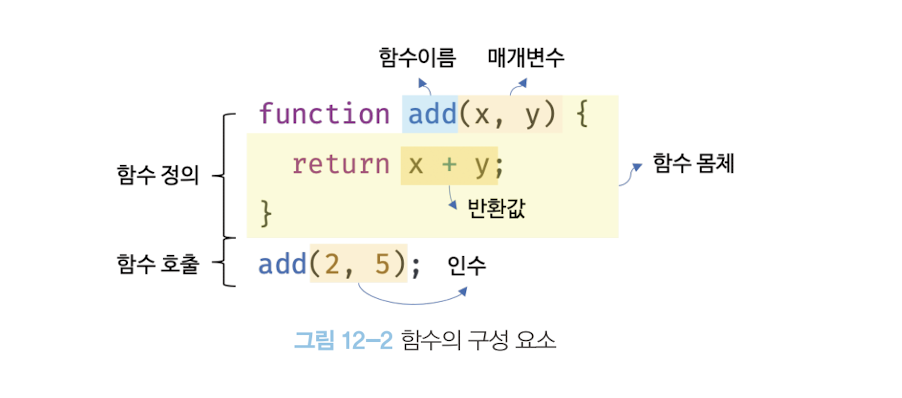
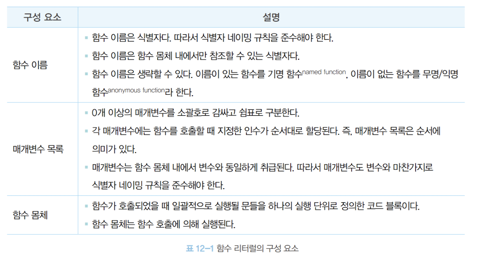
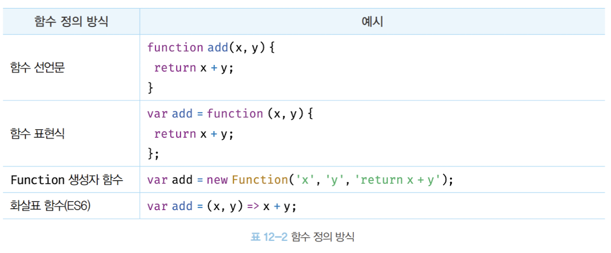
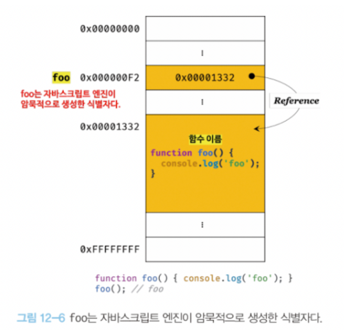
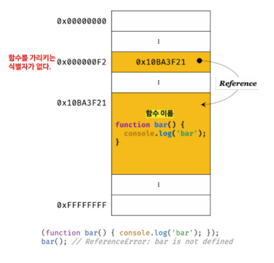
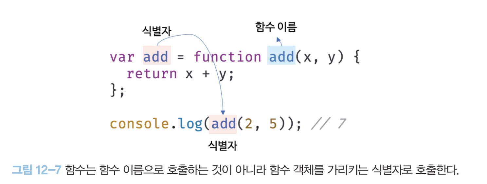
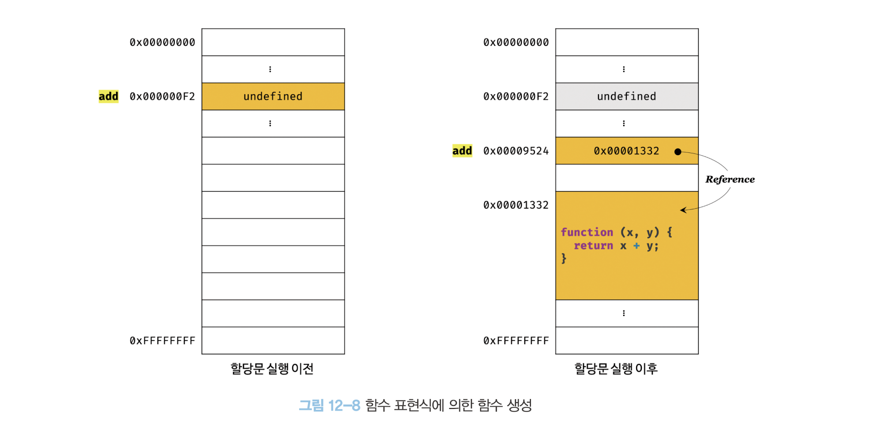
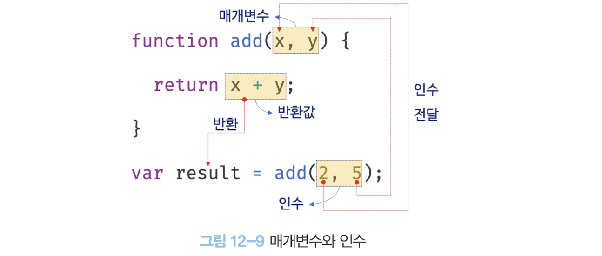
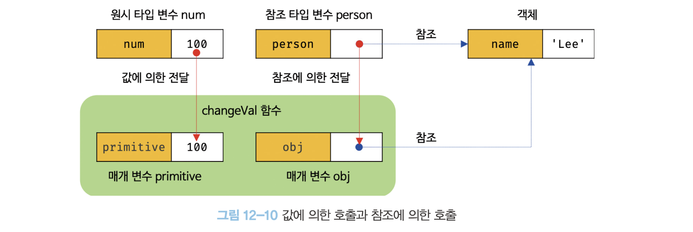

## 12.1 함수란

- 프로그래밍 언어의 함수는 일련의 과정을 문(statement)으로 구현하고 코드 블록으로 감싸서 하나의 실행 단위로 정의한 것이다.
- 프로그래밍 언어의 함수도 입력을 받아서 출력을 내보낸다. 이때 함수 내부로 입력을 전달받는 변수를 매개변수(parameter), 입력을 인수(argument), 출력을 반환값(retrun value)이라 한다. 
- 함수는 값이며, 여러 개 존재할 수 있으므로 특정 함수를 구별하기 위해 식별자인 함수 이름을 사용할 수 있다.

  

- 함수는 함수 정의(function definition)를 통해 생성한다.

```javascript
// 함수 정의
function add(x, y) {
  return x + y;
}
```

- 함수 정의만으로 함수가 실행되는 것은 아니다. 미리 정의된 일련의 과정을 실행하기 위해 필요한 입력, 즉 인수(argument)를 매개변수를 통해 함수에 전달하면서 함수의 실행을 명시적으로 지시해야 한다. 이를 함수 호출(function call/invoke)이라한다.
- 함수를 호출하면 코드 블록에 담긴 문들이 일괄적으로 실행되고, 실행 결과, 즉 반환값을 반환한다.

```javascript
// 함수 호출
var result = add(2, 5);

// 함수 add에 인수 2, 5를 전달하면서 호출하면 반환값 7을 반환한다.
console.log(result); // 7
```

## 12.2 함수를 사용하는 이유

  

- 코드의 중복을 억제하고 재사용성을 높이는 함수는 유지보수의 편의성을 높이고 실수를 줄여 코드의 신뢰성을 높이는 효과가 있다.
- 함수는 객체 타입의 값이다. 따라서 이름(식별자)을 붙일 수 있다. 참수 이름은 변수 이름과 마찬가지로 함수 자신의 역할을 잘 설명해야 한다. 적절한 함수 이름은 함수의 내부 코드를 이해하지 않고도 함수의 역할을 파악할 수 있게 돕는다. 이는 코드의 가독성을 향상 시킨다.

## 12.3 함수 리터럴

- 자바스크립트의 함수는 객체 타입의 값이다. 따라서 숫자 값을 숫자 리터럴로 생성하고 객체를 객체 리터럴로 생성하는 것처럼 함수 리터럴로 생성할 수 있다.
- 함수 리터럴은 function 키워드, 함수 이름, 매개변수 목록, 함수 몸체로 구성된다.

```javascript
// 변수에 함수 리터럴을 할당
var f = function add(x, y) {
  return x + y;
};
```

 

- 일반 객체는 호출할 수 없지만 함수는 호출할 수 있다. 그리고 일반 객체에는 없는 함수 객체만의 고유한 프로퍼티를 갖는다.

## 12.4 함수 정의

- 함수 정의란 함수를 호출하기 이전에 인수를 전달받을 매개변수와 실행할 문들, 그리고 반환할 값을 지정하는 것을 말한다.
- 정의된 함수는 자바스크립트 엔진에 의해 평가되어 함수 객체가 된다.

  

- 모든 함수 정의 방식은 함수를 정의한다는 면에서는 동일하다. 단, 미묘하지만 중요한 차이가 있다.

`변수 선언과 함수 정의`

변수는 '선언(declaration)'한다고 했지만 함수는 '정의(definition)'한다고 표현했다. 함수 선언문이 평가되면 식별자가 암묵적으로 생성되고 함수 객체가 할당된다.
따라서 ECMAScript 사양에서도 변수에는 선언(variable declaration), 함수에는 정의(function definition)라고 표현한다.

### 12.4.1 함수 선언문

```javascript
// 함수 선언문
function add(x, y) {
  return x + y;
}

// 함수 참조
// console.dir은 console.log와 달리 함수 객체의 프로퍼티까지 출력한다.
// 단, Node.js 환경에서는 console.log와 같은 결과가 출력된다.
console.dir(add); // ƒ add(x, y)

// 함수 호출
console.log(add(2, 5)); // 7
```

- 함수 선언문은 함수 리터럴과 형태가 동일하다. 단, 함수 리터럴은 함수 이름을 생략할 수 있으나 함수 선언문은 함수 이름을 생략할 수 없다.

```javascript
// 함수 선언문은 함수 이름을 생략할 수 없다.
function (x, y) {
  return x + y;
}
// SyntaxError: Function statements require a function name
```

- 함수 선언문은 표현식이 아닌 문이다.

```javascript
// 함수 선언문은 표현식이 아닌 문이므로 변수에 할당할 수 없다.
// 하지만 함수 선언문이 변수에 할당되는 것처럼 보인다.
var add = function add(x, y) {
  return x + y;
};

// 함수 호출
console.log(add(2, 5)); // 7
```

- 자바스크립트 엔진은 생성된 함수를 호출하기 위해 함수 이름과 동일한 이름의 식별자를 암묵적으로 생성하고, 거기에 함수 객체를 할당한다.

```javascript
// 기명 함수 리터럴을 단독으로 사용하면 함수 선언문으로 해석된다.
// 함수 선언문에서는 함수 이름을 생략할 수 없다.
function foo() { console.log('foo'); }
foo(); // foo

// 함수 리터럴을 피연산자로 사용하면 함수 선언문이 아니라 함수 리터럴 표현식으로 해석된다.
// 함수 리터럴에서는 함수 이름을 생략할 수 있다.
(function bar() { console.log('bar'); });
bar(); // ReferenceError: bar is not defined
```

 

  

- 함수는 함수 이름으로 호출하는 것이 아니라 함수 객체를 가리키는 식별자로 호출한다.

  

- 자바스크립트 엔진은 함수 선언문을 함수 표현식으로 변환해 함수 객체를 생성한다고 생각할 수 있다. 단, 함수 선언문과 함수 표현식이 정확히 동일하게 동작하는 것은 아니다.

### 12.4.2 함수 표현식

- 함수는 일급 객체이므로 함수 리터럴로 생성한 함수 객체를 변수에 할당할 수 있다. 이러한 함수 정의 방식을 함수 표현식(function expression)이라 한다.

```javascript
// 함수 표현식
var add = function (x, y) {
  return x + y;
};

console.log(add(2, 5)); // 7
```

- 함수 리터럴의 함수 이름은 생략할 수 있다. 이러한 함수를 익명 함수라 한다. 
- 함수 표현식의 함수 리터럴은 함수 이름을 생략하는 것이 일반적이다.
- 함수를 호출할 때는 함수 이름이 아니라 함수 객체를 가리키는 식별자를 사용해야 한다. 함수 이름은 함수 몸체 내부에서만 유효한 식별자이므로 함수 이름으로 함수를 호출할 수 없다.

```javascript
// 기명 함수 표현식
var add = function foo(x, y) {
  return x + y;
};

// 함수 객체를 가리키는 식별자로 호출
console.log(add(2, 5)); // 7

// 함수 이름으로 호출하면 ReferenceError가 발생한다.
// 함수 이름은 함수 몸체 내부에서만 유효한 식별자다.
console.log(foo(2, 5)); // ReferenceError: foo is not defined
```

- 함수 선언문은 "표현식이 아닌 문"이고 함수 표현식은 "표현식인 문"이다. 따라서 미묘하지만 중요한 차이가 있다.

### 12.4.3 함수 생성 시점과 함수 호이스팅

```javascript
// 함수 참조
console.dir(add); // ƒ add(x, y)
console.dir(sub); // undefined

// 함수 호출
console.log(add(2, 5)); // 7
console.log(sub(2, 5)); // TypeError: sub is not a function

// 함수 선언문
function add(x, y) {
  return x + y;
}

// 함수 표현식
var sub = function (x, y) {
  return x - y;
};
```

- 함수 선언문으로 정의한 함수는 함수 선언문 이전에 호출할 수 있다. 그러나 함수 표현식으로 정의한 함수는 함수 표현식 이전에 호출할 수 없다.
- 함수 선언문으로 정의한 함수와 함수 표현식으로 정의한 함수의 생성 시점이 다르기 때문이다.
- 함수 선언문으로 함수를 정의하면 런타임 이전에 함수 객체가 먼저 생성된다. 즉, 코드가 한 줄씩 순차적으로 실행되기 시작하는 런타임에는 이미 함수 객체가 생성되어 있고 함수 이름과 동일한 식별자에 할당까지 완료된 상태다.
- 함수 선언문이 코드의 선두로 끌어 올려진 것처럼 동작하는 자바스크립트 고유의 특징을 함수 호이스팅(function hoisting)이라 한다.
- 함수 표현식은 변수에 할당되는 값이 함수 리터럴인 문이다.
- 변수 할당문의 값은 할당문이 실행되는 시점, 즉 런타임에 평가되므로 함수 표현식의 함수 리터럴도 할당문이 실행되는 시점에 평가되어 함수 객체가 된다.
- 함수 표현식으로 함수를 정의하면 함수 호이스팅이 발생하는 것이 아니라 변수 호이스팅이 발생한다.

  

- 함수 표현식으로 정의한 함수는 반드시 함수 표현식 이후에 참조 또는 호출해야 한다.

### 12.4.4 Function 생성자 함수

- 자바스크립트가 제공하는 빌트인 함수인 Function 생성자 함수에 매개변수 목록과 함수 몸체를 문자열로 전달하면서 new 연산자와 함께 호출하면 함수 객체를 생성해서 반환한다. 사실 new 연산자 없이 호출해도 결과는 동일하다.

```javascript
var add = new Function('x', 'y', 'return x + y');

console.log(add(2, 5)); // 7
```

- Function 생성자 함수로 함수를 생성하는 방식은 일반적이지 않으며 바람직하지도 않다.
- Function 생성자 함수로 생성한 함수는 클로저(closure)를 생성하지 않는 등, 함수 선언문이나 함수 표현식으로 생성한 함수와 다르게 동작한다.

```javascript
var add1 = (function () {
  var a = 10;
  return function (x, y) {
    return x + y + a;
  };
}());

console.log(add1(1, 2)); // 13

var add2 = (function() {
  var a = 10;
  return new Function('x', 'y', 'return x + y + a;');
}());

console.log(add2(1, 2)); // ReferenceError: a is not defined
```

### 12.4.5 화살표 함수

- ES6에서 도입된 화살표 함수(arrow function)는 function 키워드 대신 화살표(fat arrow =>)를 사용해 좀더 간략하 방법으로 함수를 선언할 수 있다.
- 화살표 함수는 항상 익명 함수로 정의한다.

```javascript
// 화살표 함수
const add = (x, y) => x + y;
console.log(add(2, 5)); // 7
```

- 화살표 함수는 기존의 함수보다 표현만 간략한 것이 아니라 내부 동작 또한 간략화되어 있다.
- 화살표 함수는 생성자 함수로 사용할 수 없으며, 기존 함수와 this 바인딩 방식이 다르고, prototype 프로퍼티가 없으며 arguments 객체를 생성하지 않는다.

## 12.5 함수 호출

- 함수는 함수를 가리키는 식별자와 한 쌍의 소괄호인 함수 호출 연산자로 호출한다.
- 함수 호출 연산자 내에는 0개 이상의 인수를 쉼표로 구분해서 나열한다.
- 함수를 호출하면 현재의 실행 흐름을 중단하고 호출된 함수로 실행 흐름을 옮긴다.
- 이때 매개변수에 인수가 순서대로 할당되고 함수 몸체의 문들이 실행되기 시작한다.

### 12.5.1 매개변수와 인수

- 함수를 실행하기 위해 필요한 값을 함수 외부에서 함수 내부로 전달할 필요가 있는 경우, 매개변수(parameter 인자)를 통해 인수(argument)를 전달한다. 
- 인수는 값으로 평가될 수 있는 표현식이어야 한다.
- 인수는 함수를 호출할 때 지정하며, 개수와 타입에 제한이 없다.

```javascript
// 함수 선언문
function add(x, y) {
  return x + y;
}

// 함수 호출
// 인수 1과 2가 매개변수 x와 y에 순서대로 할당되고 함수 몸체의 문들이 실행된다.
var result = add(1, 2);
```

- 매개변수는 함수를 정의할 때 선언하며, 함수 몸체 내부에서 변수와 동일하게 취급된다. 즉, 함수가 호출되면 함수 몸체 내에서 암묵적으로 매개변수가 생성되고 일반 변수와 마찬가지로 undefined로 초기화된 이후 인수가 순서대로 할당된다.

 

- 매개변수는 함수 몸체 내부에서만 참조할 수 있고 함수 몸체 외부에서는 참조할 수 없다. 즉, 매개변수의 스코프(유효 범위)는 함수 내부다.

```javascript
function add(x, y) {
  console.log(x, y); // 2 5
  return x + y;
}

add(2, 5);

// add 함수의 매개변수 x, y는 함수 몸체 내부에서만 참조할 수 있다.
console.log(x, y); // ReferenceError: x is not defined
```

- 함수는 매개변수의 개수와 인수의 개수가 일치하는지 체크하지 않는다. 즉. 함수를 호출할 때 매개변수의 개수만큼 인수를 전달하는 것이 일반적이지만 그렇지 않은 경우에도 에러가 발생하지 않는다. 
- 인수가 부족해서 인수가 할당되지 않은 매개변수의 값은 undefined다.

```javascript
function add(x, y) {
  return x + y;
}

console.log(add(2)); // NaN
```

- 매개변수보다 인수가 더 많은 경우 초과된 인수는 무시된다.

```javascript
function add(x, y) {
  return x + y;
}

console.log(add(2, 5, 10)); // 7
```

- 초과된 인수가 그냥 버려지는 것은 아니다. 모든 인수는 암묵적으로 arguments 객체의 프로퍼티로 보관된다.

```javascript
function add(x, y) {
  console.log(arguments);
  // Arguments(3) [2, 5, 10, callee: ƒ, Symbol(Symbol.iterator): ƒ]

  return x + y;
}

add(2, 5, 10);
```

- arguments 객체는 함수를 정의할 때 매개변수 개수를 확정할 수 없는 가변 인자 함수를 구현할 때 유용하게 사용된다.

### 12.5.2 인수 확인

```javascript
function add(x, y) {
  return x + y;
}
```

- 위 함수를 정의한 개발자의 의도는 아마도 2개의 숫자 타입 인수를 전달받아 그 합계를 반환하려는 것으로 추측된다. 하지만 코드상으로는 어떤 타입의 인수를 전달해야 하는지, 어떤 타입의 값을 반환하는지 명확하지 않다.

```javascript
function add(x, y) {
  return x + y;
}

console.log(add(2));          // NaN
console.log(add('a', 'b'));   // 'ab'
```

- 위 코드는 자바스크립트 문법상 어떠한 문제도 없으므로 자바스크립트 엔진은 아무런 이의 제기없이 위 코드를 실행할 것이다. 
- 이러한 상황이 발생한 이유는 다음과 같다.
	- 자바스크립트 함수는 매개변수와 인수의 개수가 일치하는지 확인하지 않는다.
	- 자바스크립트는 동적 타입 언어다. 따라서 자바스크립트 함수는 매개변수의 타입을 사전에 지정할 수 없다.
- 따라서 자바스크립트의 경우 함수를 정의할 때 적절한 인수가 전달되었는지 확인할 필요가 있다.

```javascript
function add(x, y) {
  if(typeof x !== 'number' || typeof y !== 'number') {
    // 매개변수를 통해 전달된 인수의 타입이 부적절한 경우 에러를 발생시킨다.
    throw new TypeError('인수는 모두 숫자 값이어야 합니다.');
  }

  return x + y;
}

console.log(add(2));          // TypeError: 인수는 모두 숫자 값이어야 합니다.
console.log(add('a', 'b'));   // TypeError: 인수는 모두 숫자 값이어야 합니다.
```

- 인수가 전달되지 않은 경우 단축  평가를 사용해 매개변수에 기본값을 할당하는 방법도 있다.

```javascript
function add(a, b, c) {
  a = a || 0;
  b = b || 0;
  c = c || 0;
  return a + b + c;
}

console.log(add(1, 2, 3)); // 6
console.log(add(1, 2)); // 3
console.log(add(1)); // 1
console.log(add()); // 0
```

- ES6에서 도입된 매개변수 기본값을 사용하면 함수 내에서 수행하던 인수 체크 및 초기화를 간소화할 수 있다.
- 매개변수 기본값은 매개변수에 인수를 전달하지 않았을 경우와 undefined를 전달한 경우에만 유효하다.

```javascript
function add(a = 0, b = 0, c = 0) {
  return a + b + c;
}

console.log(add(1, 2, 3)); // 6
console.log(add(1, 2)); // 3
console.log(add(1)); // 1
console.log(add()); // 0
```

### 12.5.3 매개변수의 최대 개수

- ECMAScript 사양에서는 매개변수의 최대 개수에 대해 명시적으로 제한하고 있지 않다.
- 이상적인 함수는 한 가지 일만 해야 하며 가급적 작게 만들어야 한다.
- 매개변수는 최대 3개 이상을 넘지 않는 것을 권장한다.
- 만약 그 이상의 매개변수가 필요하다면 하나의 매개변수를 선언하고 객체를 인수로 전달하는 것이 유리하다.

```javascript
$.ajax({
  method: 'POST',
  url: '/user',
  data: { id: 1, name: 'Lee' },
  cache: false
});
```

- 객체를 인수로 사용하는 경우 프로퍼티 키만 정확히 지정하면 매개변수의 순서를 신경 쓰지 않아도 된다. 또한 명시적으로 인수의 의미를 설명하는 프로퍼티 키를 사용하게 되므로 코드의 가독성도 좋아지고 실수도 줄어드는 효과가 있다.
- 주의할 것은 함수 외부에서 함수 내부로 전달한 객체를 함수 내부에서 변경하면 함수 외부의 객체가 변경되는 부수 효과(sade effect)가 발생한다는 것이다.

### 12.5.4 반환문

- 함수는 return 키워드와 표현식(반환값)으로 이뤄진 반환문을 사용해 실행 결과를 함수 외부로 반환(return)할 수 있다.

```javascript
function multiply(x, y) {
  return x * y; // 반환문
}

// 함수 호출은 반환값으로 평가된다.
var result = multiply(3, 5);
console.log(result); // 15
```

- 반환문은 두가지 역할을 한다.
	- 첫째, 반환문은 함수의 실행을 중단하고 함수 몸체를 빠져나간다. 따라서 반환문 이후에 다른 문이 존재하면 그 문은 실행되지 않고 무시된다.

	```javascript
	function multiply(x, y) {
	  return x * y; // 반환문
	  
	  // 반환문 이후에 다른 문이 존재하면 그 문은 실행되지 않고 무시된다.
	  console.log('실행되지 않는다.');
	}

	console.log(multiply(3, 5)); // 15
	```

	 - 둘째, 반환문은 return 키워드 뒤에 오는 표현식을 평가해 반환한다. return 키워드 뒤에 반환값으로 사용할 표현식을 명시적으로 지정하지 않으면 undefined가 반환된다.

	```javascript
	function foo () {
	  return;
	}
  
	console.log(foo()); // undefined
	```

- 반환문은 생략할 수 있다. 이때 함수는 함수 몸체의 마지막 문까지 실행한 후 암묵적으로 undefined를 반환한다.

```javascript
function foo() {
  // 반환문을 생략하면 암묵적으로 undefined가 반환된다.
}

console.log(foo()); // undefined
```

- return 키워드와 반환값으로 사용할 표현식 사이에 줄바꿈이 있으면 세미콜론 자동 삽입 기능에 의해 세미콜론이 추가되어 다음과 같이 의도치 않은 결과가 발생할 수 있다.

```javascript
function multiply(x, y) {
  // return 키워드와 반환값 사이에 줄바꿈이 있으면
  return // 세미콜론 자동 삽입 기능(ASI)에 의해 세미콜론이 추가된다.
  x * y; // 무시된다.
}

console.log(multiply(3, 5)); // undefined
```

- 반환문은 함수 몸체 내부에서만 사용할 수 있다. 전역에서 반환문을 사용하면 문법 에러(SyntaxError: Illegal return statements)가 발생한다.

```HTML
<!DOCTYPE html>
<html>
<body>
  <script>
    return; // SyntaxError: Illegal return statements
  </script>
</body>
</html>
```

- 참고로 Node.js는 모듈 시스템에 의해 파일별로 독립적인 파일 스코프를 갖는다. 따라서 Node.js 환경에서는 파일의 가장 바깥 영역에 반환문을 사용해도 에러가 발생하지 않는다.

## 12.6 참조에 의한 전달과 외부 상태의 변경

- 매개변수도 함수 몸체 내부에서 변수와 동일하게 취급되므로 매개변수 또한 타입에 따라 값에 의한 전달, 참조에 의한 전달 방식을 그대로 따른다.

```javascript
// 매개변수 primitive는 원시 값을 전달받고, 매개변수 obj는 객체를 전달받는다.
function changeVal(primitive, obj) {
  primitive += 100;
  obj.name = 'Kim';
}

// 외부 상태
var num = 100;
var person = { name: 'Lee' };

console.log(num);     // 100
console.log(person);  // { name: 'Lee' }

// 원시 값은 값 자체가 복사되어 전달되고 객체는 참조 값이 복사되어 전달된다.
changeVal(num, person);

// 원시 값은 원본이 훼손되지 않는다.
console.log(num); // 100

// 객체는 원본이 훼손된다.
console.log(person); // { name: 'Kim' }
```

- 원시 타입 인수는 값 자체가 복사되어 매개변수에 전달되기 때문에 함수 몸체에서 그 값을 변경(재할당을 통한 교체)해도 원본은 훼손되지 않는다. 다시 말해, 외부 상태, 즉 함수 외부에서 함수 몸체 내부로 전달한 원시 값의 원본을 변경하는 어떠한 부수 효과도 발생하지 않는다.
- 객체 타입 인수는 참조 값이 복사되어 매개변수에 전달되기 때문에 함수 몸체에서 참조 값을 통해 객체를 변경할 경우 원본이 훼손된다. 다시 말해, 외부 상태, 즉 함수 외부에서 함수 몸체 내부로 전달한 참조값에 의해 원본 객체가 변경되는 부수 효과가 발생한다.

 

- 이러한 문제의 해결 방법 중 하나는 객체를 불변 객체(immutable object)로 만들어 사용하는 것이다. 
- 깊은 복사(deep copy)를 통해 새로운 객체를 생성하고 재할당을 통해 교체한다.
- 이를 통해 외부 상태가 변경된느 부수 효과를 없앨 수 있다.

## 12.7 다양한 함수의 형태

### 12.7.1 즉시 실행 함수

- 함수 정의와 동시에 즉시 호출되는 함수를 즉시 실행 함수(IIFE, Immediately Invoked Function Expression)라고 한다. 
- 즉시 실행 함수는 단 한 번만 호출되며 다시 호출할 수 없다.

```javascript
// 익명 즉시 실행 함수
(function () {
  var a = 3;
  var b = 5;
  return a * b;
}());
```

- 즉시 실행 함수는 함수 이름이 없는 익명 함수를 사용하는 것이 일반적이다.
- 함수 이름이 있는 기명 즉시 실행 함수도 사용할 수 있다. 하지만 그룹 연산자(...) 내의 기명 함수는 함수 선언문이 아니라 함수 리터럴로 평가되며 함수 이름은 함수 몸체에서만 참조할 수 있는 식별자이므로 즉시 실행 함수를 다시 호출할 수는 없다.

```javascript
// 기명 즉시 실행 함수
(function foo() {
  var a = 3;
  var b = 5;
  return a * b;
}());

foo(); // ReferenceError: foo is not defined
```

- 즉시 실행 함수는 반드시 그룹 연산자 (...)로 감싸야 한다. 그렇지 않으면 에러가 발생한다.

```javascript
function () { // SyntaxError: Function statements require a function name
  // ...
}();
```

- 에러가 발생하는 이유는 함수 정의가 함수 선언문의 형식에 맞지 않기 때문이다.

```javascript
function foo() {
  // ...
}(); // SyntaxError: Unexpected token ')'
```

- 자바스크립트 엔진이 암묵적으로 수행하는 세미콜론 자동 삽입 기능에 의해 함수 선언문이 끝나는 위치, 즉 함수 코드 블록의 닫는 중괄호 뒤에 ";"이 암묵적으로 추가되기 때문이다.

```javascript
function foo() {}(); // => function foo() {};();
```

- 함수 선언문 뒤의 (...) 는 함수 호출 연산자가 아니라 그룹 연산자로 해석되고, 그룹 연산자에 피연산자가 없기 때문에 에러가 발생한다.

```javascript
(); // SyntaxError: Unexpected token ')'
```

- 그룹 연산자의 피연산자는 값으로 평가되므로 기명 또는 무명 함수를 그룹 연산자로 감싸면 함수 리터럴로 평가되어 함수 객체가 된다.

```javascript
console.log(typeof (function f(){})); // function
console.log(typeof (function (){}));  // function
```

- 가장 일반적인 방법은 첫 번째 방식이다.

```javascript
(function () {
  // ...
}());

(function () {
  // ...
})();

!function () {
  // ...
}();

+function () {
  // ...
}();
```

- 즉시 실행 함수도 일반 함수처럼 값을 반환할 수 있고 인수를 전달할 수도 있다.

```javascript
// 즉시 실행 함수도 일반 함수처럼 값을 반환할 수 있다.
var res = (function () {
  var a = 3;
  var b = 5;
  return a * b;
}());

console.log(res); // 15

// 즉시 실행 함수에도 일반 함수처럼 인수를 전달할 수 있다.
res = (function (a, b) {
  return a * b;
}(3, 5));

console.log(res); // 15
```

- 즉시 실행 함수 내에 코드를 모아 두면 혹시 있을 수도 있는 변수나 함수 이름의 충돌을 방지할 수 있다.

### 12.7.2 재귀 함수

- 함수가 자기 자신을 호출하는 것을 재귀 호출(recursive call)이라 한다. 재귀 함수(recursive function)는 자기 자신을 호출하는 행위, 즉 재귀 호출을 수행하는 함수를 말한다.

```javascript
function countdown(n) {
  for (var i = n; i >= 0; i--) console.log(i);
}

countdown(10);
```

```javascript
function countdown(n) {
  if (n < 0) return;
  console.log(n);
  countdown(n - 1); // 재귀 호출
}

countdown(10);
```

- 자기 자신을 호출하는 재귀 함수를 사용하면 반복되는 처리를 반복문 없이 구현할 수 있다.

```javascript
// 팩토리얼(계승)은 1부터 자신까지의 모든 양의 정수의 곱이다.
// n! = 1 * 2 * ... * (n-1) * n
function factorial(n) {
  // 탈출 조건: n이 1이하일 때 재귀 호출을 멈춘다.
  if (n <= 1) return 1;
  // 재귀 호출
  return n * factorial(n - 1);
}

console.log(factorial(0)); // 0! = 1
console.log(factorial(1)); // 1! = 1
console.log(factorial(2)); // 2! = 2
console.log(factorial(3)); // 3! = 6
console.log(factorial(4)); // 4! = 24
console.log(factorial(5)); // 5! = 120
```

- 함수 이름은 함수 몸체 내부에서만 유효하다. 따라서 함수 이름을 사용해 자기 자신을 호출할 수 있다.
- 함수 표현식으로 정의한 함수 내부에서는 함수 이름은 물론 함수를 가리키는 식별자로도 자기 자신을 재구 호출할 수 있다.
- 단, 함수 외부에서 함수를 호출할 때는 반드시 함수를 가리키는 식별자로 해야 한다.

```javascript
// 함수 표현식
var factorial = function foo(n) {
  // 탈출 조건: n이 1이하일 때 재귀 호출을 멈춘다.
  if (n <= 1) return 1;
  // 함수를 가리키는 식별자로 자기 자신을 재귀 호출
  return n * factorial(n - 1);

  // 함수 이름으로 자기 자신을 재귀 호출할 수도 있다.
  // console.log(factorial === foo); // true
  // return n * foo(n - 1);
}

console.log(factorial(5)); // 5! = 5 * 4 * 3 * 2 * 2 * 1 = 120

function factorial(n) {
  if (n <= 1) return 1;
  
  var res = n;
  while (--n) res *= n;
  return res;
}

console.log(factorial(0)); // 0! = 1
console.log(factorial(1)); // 1! = 1
console.log(factorial(2)); // 2! = 2 * 1 = 2
console.log(factorial(3)); // 3! = 3 * 2 * 1 = 6
console.log(factorial(4)); // 4! = 4 * 3 * 2 * 1 = 24
console.log(factorial(5)); // 5! = 5 * 4 * 3 * 2 * 1 = 120
```

- 재귀 함수는 자신을 무한 재귀 호출한다. 따라서 재귀 함수 내에는 재귀 호출을 멈출 수 있는 탈출 조건을 반드시 만들어야 한다.
- 재귀 함수는 반복문을 사용하는 것보다 재귀 함수를 사용하는 편이 더 직관적으로 이해하기 쉬울 때만 한정적으로 사용하는 것이 바람직하다.

### 12.7.3 중첩 함수

- 함수 내부에 정의된 함수를 중첩 함수(nested function) 또는 내부 함수(inner function)라 한다.
- 중첩 함수를 포함하는 함수는 외부 함수(outer function)라 부른다. 
- 중첩 함수는 외부 함수 내부에서만 호출할 수 있다. 일반적으로 중첩 함수는 자신을 포함하는 외부 함수를 돕는 헬퍼 함수(helper function)의 역할을 한다.

```javascript
function outer() {
  var x = 1;

  // 중첩 함수
  function inner() {
    var y = 2;
    // 외부 함수의 변수를 참조할 수 있다.
    console.log(x + y); // 3
  }

  inner();
}

outer();
```

- ES6부터 함수 정의는 문이 위치할 수 있는 문맥이라면 어디든지 가능하다.
- 함수 선언문의 경우 ES6 이전에는 코드의 최상위 또는 다른 함수 내부에서만 정의할 수 있었으나 ES6부터는 if 문이나 for 문 등의 코드 블록 내에서도 정의할 수 있다.
- 단, 호이스팅으로 인해 혼란이 발생할 수 있으므로 if 문이나 for 문 등의 코드 블록에서 함수 선언문을 통해 함수를 정의하는 것은 바람직하지 않다.

### 12.7.4 콜백 함수

```javascript
// n만큼 어떤 일을 반복한다.
function repeat(n) {
  // i를 출럭한다.
  for (var i = 0; i < n; i++) console.log(i);
}

repeat(5); // 0 1 2 3 4
```

```javascript
// n만큼 어떤 일을 반복한다.
function repeat1(n) {
  // i를 출럭한다.
  for (var i = 0; i < n; i++) console.log(i);
}

repeat1(5); // 0 1 2 3 4

// n만큼 어떤 일을 반복한다.
function repeat2(n) {
  for (var i = 0; i < n; i++) {
    // i가 홀수일 때만 출럭한다.
    if (i % 2) console.log(i);
  }
}

repeat2(5); // 1 3
```

- 위 예제의 함수들은 반복하는 일은 변하지 않고 공통적으로 수행하지만 반복하면서 하는 일의 내용은 다르다. 즉, 함수의 일부분만이 다르기 때문에 매번 함수를 새롭게 정의해야 한다.
- 이 문제는 함수를 합성하는 것으로 해결할 수 있다.
- 함수의 변하지 않는 공통 로직은 미리 정의해 두고, 경우에 따라 변경되는 로직은 추상화 해서 함수 외부에서 함수 내부로 전달하는 것이다.

```javascript
// 외부에서 전달받은 f를 n만큼 호출한다.
function repeat(n, f) {
  for(var i = 0; i < n; i++) {
    f(i);
  }
}

var logAll = function (i) {
  console.log(i);
}

// 반복 호출할 함수를 인수로 전달한다.
repeat(5, logAll); // 0 1 2 3 4

var logOdds = function (i) {
  if (i % 2) console.log(i);
}

// 반복 호출할 함수를 인수로 전달한다.
repeat(5, logOdds); // 1 3
```

- 함수의 매개변수를 통해 다른 함수의 내부로 전달되는 함수를 콜백 함수(callback function)라고 하며, 매개변수를 통해 함수의 외부에서 콜백 함수를 전달받은 함수를 고차 함수(Higher-Order Function, HOF)라고 한다.
- 고차 함수는 콜백 함수를 자신의 일부분으로 합성한다.
- 고차 함수는 매개변수를 통해 전달받은 콜백 함수의 호출 시점을 결정해서 호출한다. 
- 콜백 함수는 고차 함수에 의해 호출되며 이때 고차 함수는 필요에 따라 콜백 함수인수를 전달할 수 있다.
- 콜백 함수가 고차 함수 내부에만 호출된다면 콜백 함수를 익명 함수 리터럴로 정의하면서 곧바로 고차 함수에 전달하는 것이 일반적이다.

```javascript
// 익명 함수 리터럴을 콜백 함수로 고차 함수에 전달한다.
// 익명 함수 리터럴은 repeat 함수를 호출할 때마다 평가되어 함수 객체를 생성한다.
repeat(5, function(i) {
  if (i % 2) console.log(i);
}); // 1 3
```

- 콜백 함수로서 전달된 함수 리터럴은 고차 함수가 호출될 때마다 평가되어 함수 객체를 생성한다. 따라서 콜백 함수를 다른 곳에서도 호출할 필요가 있거나. 콜백함수를 전달받는 함수가 자주 호출된다면 함수 외부에서 콜백함수를 정의한 후 함수 참조를 고차함수에 전달하는 편이 효율적이다.

```javascript
// logOdds 함수는 단 한 번만 생성된다.
var logOdds = function (i) {
  if (i % 2) console.log(i);
};

// 고차 함수에 함수 참조를 전달한다.
repeat(5, logOdds); // 1 3
```

- 콜백 함수는 함수형 프로그래밍 패러다임뿐만 아니라 비동기 처리(이벤트 처리, Ajax 통신, 타이머 함수 등)에 활용되는 중요한 패턴이다.

```javascript
// 콜백 함수를 사용한 이벤트 처리
// myButton 버튼을 클릭하면 콜백 함수를 실행한다.
document.getElementById('myButton').addEventListener('click', function () {
  console.log('button clicked!');
});

// 콜백 함수를 사용한 비동기 처리
// 1초 후에 메시지를 출력한다.
setTimeout(function () {
  console.log('1초 경과');
}, 1000);
```

- 콜백 함수는 비동기 처리뿐 아니라 배열 고차 함수에서도 사용된다. 
- 자바스크립트에서 배열은 사용 빈도가 매우 높은 자료구조이고 배열을 다룰 때 배열 고차 함수는 매우 중요하다.

```javascript
// 콜백 함수를 사용하는 고차 함수 map
var res = [1, 2, 3].map(function (item) {
  return item * 2;
});

console.log(res); // [ 2, 4, 6 ]

// 콜백 함수를 사용하는 고차 함수 filter
res = [1, 2, 3].filter(function (item) {
  return item % 2;
});

console.log(res); // [ 1, 3 ]

// 콜백 함수를 사용하는 고차 함수 reduce
res = [1, 2, 3].reduce(function (acc, cur) {
  return acc + cur;
}, 0);

console.log(res); // 6
```

### 12.7.5 순수 함수와 비순수 함수

- 함수형 프로그래밍에서는 어떤 외부 상태에 의존하지도 않고 변경하지도 않는, 즉 부수 효과가 없는 함수를 순수 함수(pure function)라 하고, 외부 상태에 의존하거나 외부 상태를 변경하는, 즉 부수 효과가 있는 함수를 비순수 함수(impure function)라고 한다.
- 순수 함수는 동일한 인수가 전달되면 언제나 동일한 값을 반환하는 함수다.
- 즉, 순수 함수는 어떤 외부 상태에도 의존하지 않고 오직 매개변수를 통해 함수 내부로 전달된 인수에게만 의존해 값을 생성해 반환한다.
- 함수의 외부 상태에 의존하는 함수는 외부 상태에 따라 반환값이 달라진다. 
- 외부 상태에는 전역변수, 서버 데이터, 파일, Console, DOM 등이 있다.
- 만약 외부 상태에는 의존하지 않고 함수 내부 상태에만 의존한다 해도 그 내부 상태가 호출될 때마다 변화하는 값(예: 현재 시간)이라면 순수 함수가 아니다.
- 순수 함수는 일반적으로 최소 하나 이상의 인수를 전달받는다.
- 인수를 전달받지 않는 순수 함수는 언제나 동일한 값을 반환하므로 결국 상수와 마찬가지다. 따라서 최소 하나 이상의 인수를 전달받지 않는 순수 함수는 그다지 의미가 없다.
- 순수 함수는 인수를 변경하지 않는 것이 기본이다. 다시 말해, 순수 함수는 인수의 불변성을 유지한다.
- 순수 함수의 또 하나의 특징은 함수의 외부 상태를 변경하지 않는다는 것이다. 즉, 순수 함수는 어떤 외부 상태에도 의존하지 않으며 외부 상태를 변경하지도 않는 함수다.

```javascript
var count = 0; // 현재 카운트를 나타내는 상태

// 순수 함수 increase는 동일한 인수가 전달되면 언제나 동일한 값을 반환한다.
function increase(n) {
  return ++n;
}

// 순수 함수가 반환한 결과값을 변수에 재할당해서 상태를 변경
count = increase(count);
console.log(count); // 1

count = increase(count);
console.log(count); // 2
```

- 함수의 외부 상태에 따라 반환값이 달라지는 함수. 다시 말해 외부 상태에 의존하는 함수를 비순수 함수라고 한다.
- 비순수 함수의 또 하나의 특징은 순수 함수와는 달리 함수의 외부 상태를 변경하는 부수 효과가 있다는 것이다, 즉 비순수 함수는 외부 상태에 의존하거나 외부 상태를 변경하는 함수다.

```javascript
var count = 0; // 현재 카운트를 나타내는 상태: increase 함수에 의해 변화한다.

// 비순수 함수
function increase() {
  return ++count; // 외부 상태에 의존하며 외부 상태를 변경한다.
}

// 비순수 함수는 외부 상태(count)를 변경하므로 상태 변화를 추적하기 어려워진다.
count = increase();
console.log(count); // 1

count = increase();
console.log(count); // 2
```

- 함수 내부에서 외부 상태를 직접 참조하지 않더라도 매개변수를 통해 객체를 전달받으면 비순수 함수가 된다.
- 함수가 외부 상태를 변경하면 상태 변화를 추적하기 어려워진다. 따라서 함수 외부 상태의 변경을 지양하는 순수 함수를 사용하는 것이 좋다.
- 비순수 함수를 최대한 줄이는 것은 부수 효과를 최대한 억제하는 것과 같다.

`함수형 프로그래밍`

함수형 프로그래밍은 순수 함수와 보조 함수의 조합을 통해 외부 상태를 변경하는 부수 효과를 최소화해서 불변셩을 지향하는 프로그래밍 패러다임이다.
로직 내에 존재하는 조건문과 반복문을 제거해서 복잡성을 해결하며, 변수 사용을 억제하거나 생명주기를 최소화해서 상태 변경을 피해 오류를 최소화하는 것을 목표로 한다. 조건문이나 반복문은 로직의 흐름을 이해하기 어렵게 해서 가독성을 해치고, 변수의 값은 누군가에 의해 언제든지 변경될 수 있어 오류 발생의 근본적인 원이니 될 수 있기 때문이다.