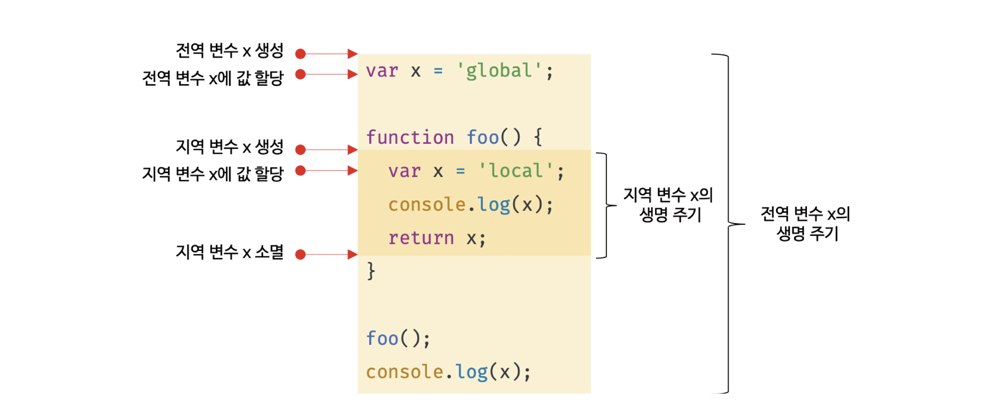

## 14.1 변수의 생명주기

- 변수의 생명 주기는 메모리 공간이 확보(allocate)된 시점부터 메모리 공간이 해제(release)되어 가용 메모리 풀(memory pool)에 반환되는 시점까지다.
### 14.1.1 지역 변수의 생명 주기

- 지역 변수의 생명 주기는 함수의 생명 주기와 일치한다.

```javascript
function foo() {
  var x = 'local';
  console.log(x); // local
  return x;
}

foo();
console.log(x); // ReferenceError: x is not defineds
```


- 함수 몸체 내부에서 선언된 지역 변수의 생명 주기는 함수의 생명 주기와 대부분 일치하지만 지역 변수가 함수보다 오래 생존하는 경우도 있다.
- 일반적으로 함수가 종료하면 함수가 생성한 스코프도 소멸한다. 하지만 누군가가 스코프를 참조하고 있다면 스코프는 해제되지 않고 생존하게 된다.
### 14.1.2 전역 변수의 생명 주기

- var 키워드로 선언한 전역 변수는 전역 객체의 프로퍼티가된다.
- var 키워드로 선언한 전역 변수의 생명 주기는 전역 객체의 생명 주기와 일치한다.
- 브라우저 환경에서 전역 객체는 window이므로 브라우저 환경에서 var 키워드로 선언한 전역 변수는 전역 객체 window의 프로퍼티다.
- 전역 객체 window는 웹페이지를 닫기 전까지 유효하다. 따라서 브라우저 환경에서 var 키워드로 선언한 전역 변수는 웹페이지를 닫을 때까지 유효하다.


## 14.2 전역 변수의 문제점

- 암묵적 결합
	- 전역 변수를 선언한 의도는 전역, 즉 코드 어디서든 참조하고 할당할 수 있는 변수를 사용하겠다는 것이다.
	- 이는 모든 코드가 전역 변수를 참조하고 변경할 수 있는 암묵적 결합(implicit coupling)을 허용하는 것이다.
	- 변수의 유효 범위가 크면 클수록 코드의 가독성은 나빠지고 의도치 않게 상태가 변경될 수 있는 위험성도 높아진다.

- 긴 생명 주기
	- 전역 변수는 생명 주기가 길다. 따라서 메모리 리소스도 오랜 기간 소비한다. 또한 전역 변수의 상태를 변경할 수 있는 시간도 길고 기회도 많다.
	- var 키워드는 변수의 중복을 허용하므로 생명 주기가 긴 전역 변수는 변수 이름이 중복될 가능성이 있다. 변수 이름이 중복되면 의도치 않은 재할당이 이뤄진다.

	```javascript
	var x = 1;

	// ...
	
	// 변수의 중복 선언. 기존 변수에 값을 재할당한다.
	var x = 100;
	console.log(x); // 100
	```

	- 지역 변수는 전역 변수보다 생명 주기가 훨씬 짧다.
	- 크지 않은 함수의 지역 변수는 생존 시간이 극히 짧다. 따라서 지역 변수의 상태를 변경할 수 있는 시간도 짧고 기회도 적다.
	- 이는 전역 변수보다 상태 변경에 의한 오류가 발생할 확률이 작다는 것을 의미한다. 또한 메모리 리소스도 짧은 기간만 소비한다.

- 스코프 체인 상에서 종점에 존재
	- 전역 변수는 스코프 체인 상에서 종점에 존재한다. 
	- 이는 변수를 검색할 때 전역 변수가 가장 마지막에 검색된 다는 것을 말한다. 즉, 전역 변수의 검색 속도가 가장 느리다. 
	- 검색 속도의 차이는 그다지 크지 않지만 속도의 차이는 분명히 있다. 

- 네임스페이스 오염
	- 자바스크립트의 가장 큰 문제점 중 하나는 파일이 분리되어 있다 해도 하나의 전역 스코프를 공유한다는 것이다.
	- 따라서 다른 파일 내에서 동일한 이름으로 명명된 전역 변수나 전역 함수가 같은 스코프 내에 존재할 경우 예상치 못한 결과를 가져올 수 있다.

## 14.3 전역 변수의 사용을 억제하는 방법

- 전역 변수를 반드시 사용해야 할 이유를 찾지 못한다면 지역 변수를 사용해야 한다.
- 변수의 스코프는 좁을수록 좋다.

### 14.3.1 즉시 실행 함수

- 함수 정의와 동시에 호출되는 즉시 실행 함수는 단 한 번만 호출된다.
- 모든 코드를 즉시 실행 함수로 감싸면 모든 변수는 즉시 실행 함수의 지역 변수가 된다.
- 이러한 특성을 이용해 전역 변수의 사용을 제한한느 방법이다.

```javascript
(function () {
  var foo = 10; // 즉시 실행 함수의 지역 변수
  //...
}());

console.log(foo); // ReferenceError: foo is not defined
```

- 이 방법을 사용하면 전역 변수를 생성하지 않으므로 라이브러리 등에 자주 사용된다.

### 14.3.2 네임 스페이스 객체

- 전역에 네임스페이스(namespace) 역할을 담당할 객체를 생성하고 전역 변수처럼 사용하고 싶은 변수를 프로퍼티로 추가하는 방법이다.

```javascript
var MYAPP = {}; // 전역 네임스페이스 객체

MYAPP.name = 'Lee';

console.log(MYAPP.name); // Lee
```

- 네임스페이스 객체에 또 다른 네임스페이스 객체를 프로퍼티로 추가해서 네임스페이스를 계층적으로 구성할 수도 있다.

```javascript
var MYAPP = {}; // 전역 네임스페이스 객체

MYAPP.person = {
  name: 'Lee',
  address: 'Seoul'
};

console.log(MYAPP.person.name); // Lee
```

- 네임스페이스를 분리해서 식별자 충돌을 방지하는 효과는 있으나 네임스페이스 객체 자체가 전역 변수에 할당되므로 그다지 유용해 보이지는 않는다.

### 14.3.3 모듈 패턴

- 모듈 패턴은 클래스를 모방해서 관련이 있는 변수와 함수를 모아 즉시 실행 함수로 감싸 하나의 모듈을 만든다.
- 모듈 패턴은 자바스크립트의 강력한 기능인 클러저를 기반으로 동작한다.
- 모듈 패턴의 특징은 전역 변수의 억제는 물론 캡슐화까지 구현할 수 있다는 것이다.

```javascript
var Counter = (function () {
  // private 변수
  var num = 0;

  // 외부로 공개할 데이터나 메서드를 프로퍼티로 추가한 객체를 반환한다.
  return {
    increase() {
      return ++num;
    },
    decrease() {
      return --num;
    }
  };
}());

// private 변수는 외부로 노출되지 않는다.
console.log(Counter.num); // undefined

console.log(Counter.increase()); // 1
console.log(Counter.increase()); // 2
console.log(Counter.decrease()); // 1
console.log(Counter.decrease()); // 0
```

### 14.3.4 ES6 모듈

- ES6 모듈은 사용하면 더는 전역 변수를 사용할 수 없다.
- ES6 모듈은 파일 자체의 독자적인 모듈 스코프를 제공한다.
- 따라서 모듈 내에서 var 키워드로 선안한 변수는 더는 전역 변수가 아니며 window 객체의 프로퍼티도 아니다.
- script 태그에 type="module" 어트리뷰트를 추가하면 로드된 자바스크립트 파일은 모듈로서 동작한다. 모듈의 파일 확장자는 mjs를 권장한다.

```html
<script type="module" src="lib.mjs"></script>
<script type="module" src="app.mjs"></script>
```

- 브라우저의 ES6 모듈 기능을 사용하더라도 트랜스파일링이나 번들링이 필요하기 때문에 아직까지 브라우저가 지원하는 ES6 모듈 기능보다는 Webpack 등의 모듈 번들러를 사용하는 것이 일반적이다.