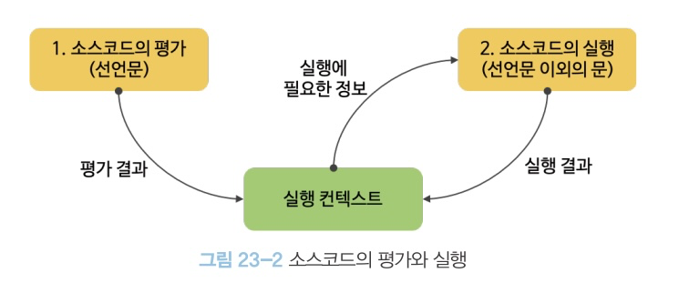
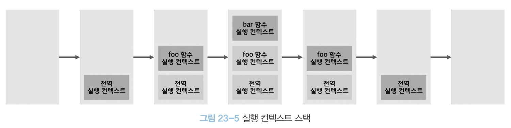
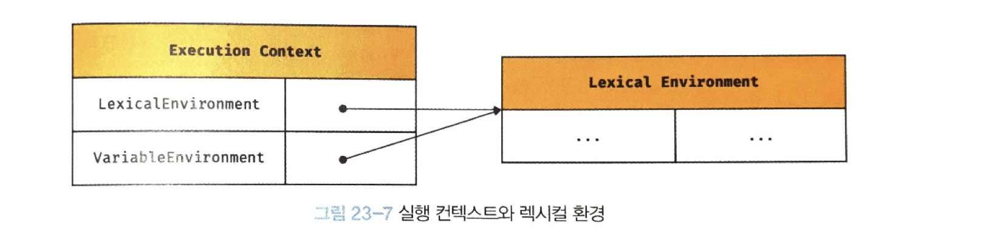
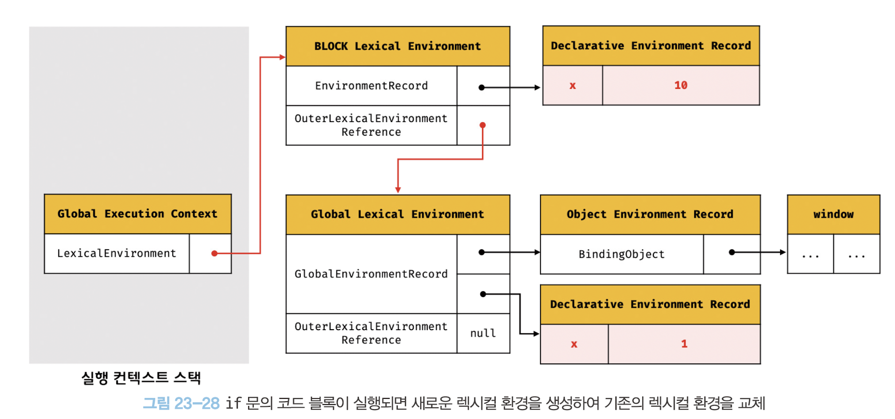
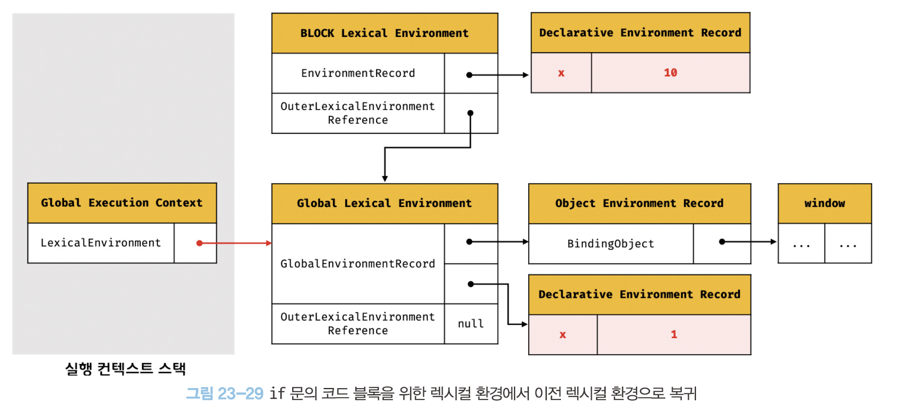

# 23 실행 컨텍트스

실행 컨텍스트(execution context)는 자바스크립트 동작 원리를 담고 있는 핵심 개념이다. 실행 컨텍스트를 바르게 이해하면 자바스크립트가 스코프를 기반으로 식별자와 식별자에 바인딩된 값(식별자 바인딩)을 관리하는 방식과 호이스팅이 발생하는 이유, 클로저의 동작 방식, 그리고 태스크 큐와 함께 동작하는 이벤트 핸들러와 비동기 처리의 동작 방식을 이해할 수 있다.

## 23.1 소스코드의 타입

ECMAScript 사양은 소스코드(ECMAScript code)를 4가지 타입으로 구분한다. 
4가지 타입의 소스코드는 실행 컨텍스트를 생성한다.

| 소스코드의 타입             | 설명                                                            |
| -------------------- | ------------------------------------------------------------- |
| 전역 코드(global code)   | 전역에 존재하는 소스코드를 말한다. 전역에 정의된 함수, 클래스 등의 내부 코드는 포함되지 않는다.       |
| 함수 코드(function code) | 함수 내부에 존재하는 소스코드를 말한다. 함수 내부에 중첩된 함수, 클래스 등의 내부 코드는 포함되지 않는다. |
| eval 코드(eval code)   | 빌트인 전역 함수인 eval 함수에 인수로 전달되어 실행되는 소스코드를 말한다.                  |
| 모듈 코드(module code)   | 모듈 내부에 존재하는 소스코드를 말한다. 모듈 내부의 함수, 클래스 등의 내부 코드는 포함되지 않는다.     |
1. 전역 코드
	- 전역 코드는 전역 변수를 관리하기 위해 최상위 스코프인 전역 스코프를 생성해야 한다. 그리고 var 키워드로 선언된 전역 변수와 함수 선언문으로 정의된 전역 함수를 전역 객체의 프로퍼티와 메서드로 바인딩하고 참조하기 위해 전역 객체와 연결되어야 한다. 이를 위해 전역 코드가 평가되면 전역 실행 컨택스트가 생성된다.
2. 함수 코드
	- 함수 코드는 지역 스코프를 생성하고 지역 변수, 매개변수, arguments 객체를 관리해야 한다. 그리고 생성한 지역 스코프를 전역 스코프에서 시작하는 스코프 체인의 일원으로 연결해야 한다. 이를 위해 함수 코드가 평가되면 함수 실행 컨텍스트가 생성된다.
3. eval 코드
	- eval 코드는 strict mode(엄격 모드)에서 자신만의 독자적인 스코프를 생성한다. 이를 위해 eval 코드가 평가되면 eval 실행 컨텍스트가 생성된다.
4. 모듈코드
	- 모듈 코드는 모듈별로 독립적인 모듈 스코프를 생성한다. 이를 위해 모듈 코드가 평가되면 모듈 실행 컨텍스트가 생성된다.
## 23.2 소스코드의 평가와 실행

자바스크립트 엔진은 소스코드를 2개의 과정, 즉 "소스코드의 평가"와 "소스코드의 실행" 과정으로 나누어 처리한다.

`소스코드 평가`
- 실행 컨텍스트를 생성하고 변수, 함수 등의 선언문만 먼저 실행하여 생성된 변수나 함수 식별자를 키로 실행 컨텍스크가 관리하는 스코프(렉시컬 환경의 환경 레코드)에 등록된다.

`소스코드 실행`
- 소스코드 평가 과정이 끝나면 비로소 선언문을 제외한 소스코드가 순차적으로 실행되기 시작한다.(런타임 시작)
- 이때 소스코드 실행에 필요한 정보, 즉 변수나 함수의 참조를 실행 컨텍스트가 관리하는 스코프에서 검색해서 취득한다.
- 그리고 변수 값의 변경 등 소스코드의 실행 결과는 다시 실행 컨텍스트가 관리하는 스코프에 등록된다.



## 23.3 실행 컨텍스트의 역할

코드가 실행되려면 다음과 같이 스코프, 식별자, 코드 실행 순서 등의 관리가 필요하다.

1. 선언에 의해 생성된 모든 식별자(변수, 함수, 클래스 등)를 스코프를 구분하여 등록하고 상태 변화(식별자에 바인딩된 값의 변화)를 지속적으로 관리할 수 있어야 한다.
2. 스코프는 중첩 관계에 의해 스코프 체인을 형성해야 한다. 즉, 스코프 체인을 통해 상위 스코프로 이동하며 식별자를 검색할 수 있어야 한다.
3. 현재 실행 중인 코드의 실행 순서를 변경(예를 들어, 함수 호출에 의한 실행 순서 변경)할 수 있어야 하며 다시 되돌아갈 수도 있어야 한다.

이 모든 것을 관리하는 것이 바로 실행 컨텍스트다.

실행 컨텍스트는 소스코드를 실행하는 데 필요한 환경을 제공하고 코드의 실행 결과를 실제로 관리하는 영역이다.

실행 컨텍스트는 식별자(변수, 함수, 클래스 등의 이름)를 등록하고 관리하는 스코프와 코드 실행 순서 관리를 구현한 내부 메커니즘으로, 모든 코드는 실행 컨텍스트를 통해 실행되고 관리된다.

식별자와 스코프는 실행 컨텍스트의 **렉시컬 환경**으로 관리하고 실행 순서는 **실행 컨텍스트 스택**으로 관리한다.

## 23.4 실행 컨텍스트 스택

자바스크립트 엔진은 먼저 전역 코드를 펑가하여 전역 실행 컨텍스트를 생성한다. 그리고 함수가 호출되면 함수 코드를 평가하여 함수 실행 컨텍스트를 생성한다.
이때 생성된 실행 컨텍스트는 스택(stack) 자료구조로 관리된다. 이를 실행 컨텍스트 스택(콜 스택(call stack))이라고 한다. 



실행 컨텍스트 스택은 코드의 실행 순서를 관리한다. 
실행 컨텍스트 스택의 최상위에 존재하는 실행 컨텍스트는 언제나 현재 실행 중인 코드의 실행 컨텍스트다.
실행 컨텍스트 스택의 최상위에 존재하는 실행 컨텍스트를 실행 중인 실행 컨택스트(running execution context)라 부른다.

## 23.5 렉시컬 환경

- 렉시컬 환경(Lexical Environment)은 식별자와 식별자에 바인딩된 값, 그리고 상위 스코프에 대한 참조를 기록하는 자료구조로 실행 컨텍스트를 구성하는 컴포넌트다.
- 실행 컨텍스트 스택이 코드의 실행 순서를 관리한다면 렉시컬 환경은 스코프와 식별자를 관리한다.
- 렉시컬 환경은 키와 값을 갖는 객체 형태의 스코프(전역, 함수, 블록 스코프)를 생성하여 식별자를 키로 등록하고 식별자에 바인딩된 값을 관리한다. 즉, 렉시컬 환경은 스코프를 구분하여 식별자를 등록하고 관리하는 저장소 역할을 하는 렉시컬 스코프의 실체다.

실행 컨텍스트는 LexicalEnvironment 컴포넌트와 VariableEnvironment 컴포넌트로 구성된다. 

- 생성 초기에  LexicalEnvironment 컴포넌트와 VariableEnvironment 컴포넌트는 하나의 동일한 렉시컬 환경을 참조한다.
- 이후 몇 가지 상황을 만나면 VariableEnvironment 컴포넌트를 위한 새로운 렉시컬 환경을 생성하고, 이때부터 VariableEnvironment 컴포넌트와 LexicalEnvironment 컴포넌트는 내용이 달라지는 경우도 있다.


렉시컬 환경은 두개의 컴포넌트로 구성된다.

1. 환경 레코드(Environment Record)
	- 스코프에 포함된 식별자를 등록하고 등록된 식별자에 바인딩된 값을 관리하는 저장소다.
	- 환경 레코드는 소스코드의 타입에 따라 관리한는 내용에 차이가 있다.
2. 외부 렉시컬 환경에 대한 참조(Outer Lexical Environment Reference)
	- 외부 렉시컬 환경에 대한 참조는 상위 스코프를 가리킨다.
	- 이때 상위 스코프란 외부 렉시컬 환경, 즉 해당 실행 컨텍스트를 생성한 소스코드를 포함하는 상위 코드의 렉시컬 환경을 말한다.
	- 외부 렉시컬 환경에 대한 참조를 통해 단방향 링크드 리스트인 스코프 체인을 구현한다.

## 23.7 실행 컨텍스트와 블록 레벨 스코프

- var 키워드로 선언한 변수는 오로지 함수의 코드 블록만 지역 스코프로 인정하는 함수 레벨 스코프를 따른다.
- 하지만 let, const 키워드로 선언한 변수는 모든 코드 블록(함수, if 문, for 문, while 문, try/catch 문 등)을 지역 스코프로 인정하는 블록 레벨 스코프(block-level scope)를 따른다.

```javascript
let x = 1;

if (true) {
  let x = 10;
  console.log(x); // 10
}

console.log(x); // 1
```

- if 문의 코드 블록 내에서 let 키워드로 변수가 선언되었다. 따라서 if 문의 코드 블록이 실행되면 if 문의 코드 블록을 위한 블록 레벨 스코프를 생성해야 한다. 
- 이를 위해 선언적 환경 레코드를 갖는 렉시컬 환경을 새롭게 생성하여 기존의 전역 렉시컬 환경을 교체한다. 
- 이때 새롭게 생성된 if 문의 코드 블록을 위한 렉시컬 환경의 외부 렉시컬 환경에 대한 참조는 if 문이 실행되기 이전의 전역 렉시컬 환경을 가리킨다.



- if 문 코드 블록의 실행이 종료되면 if 문의 코드 블록이 실행되기 이전의 렉시컬 환경으로 되돌린다.



- 이는 if 문뿐 아니라 블록 레벨 스코프를 생성하는 모든 블록문에 적용된다.

- for 문의 변수 선언문에 let 키워드를 사용한 for 문은 코드 블록이 반복해서 실행될 때마다 코드 블록을 위한 새로운 렉시컬 환경을 생성한다. 
- 만약 for 문의 코드 블록 내에서 정의된 함수가 있다면 이 함수의 상위 스코프는 for 문의 코드 블록이 생성한 렉시컬 환경이다.
- 이때 함수의 상위 스코프는 for 문의 코드 블록이 반복해서 실행될 때마다 식별자(for 문의 변수 선언문 및 for 문의 코드 블록 내에서 선언된 지역 변수 등)의 값을 유지해야 한다.
- 이를 위해 for 문의 코드 블록이 반복해서 실행될 때마다 독립적인 렉시컬 환경을 생성하여 식별자의 값을 유지한다.